# 07 — Information Architecture & Permission Matrix

**Mục đích:** Bức tranh tổng thể về cấu trúc sản phẩm — cách 20 màn hình liên kết với nhau, ai thấy được gì, data chảy thế nào.

**Đối tượng đọc:** Developers, Designers, Product Managers, new team members

---

## 1. Site Map — Toàn cảnh 20 màn hình

### Tổng quan theo Role

```mermaid
flowchart TD
    Root([LUMINA Platform])
    
    Root --> Unauth[Unauthenticated]
    Root --> Learner[Learner Side]
    Root --> Parent[Parent Side]
    Root --> Admin[Admin Side]
    
    %% Unauth
    Unauth --> Landing[Landing Page<br/>marketing]
    Unauth --> ParentLanding[Parent Landing<br/>lumina/parents]
    Unauth --> Login[Login/Signup]
    
    %% Learner
    Learner --> S5[5 Gateway<br/>chọn ngành]
    Learner --> S6[6 Hub Dashboard<br/>timeline 7 ngày]
    Learner --> S7[7 Workspace<br/>trái tim]
    Learner --> S8[8 Buddy Chat]
    Learner --> S9[9 Widget Preview]
    Learner --> S10[10 Final Report]
    Learner --> S11[11 Portfolio Archive]
    Learner --> S12[12 System States]
    
    %% Parent
    Parent --> S20[20 Parent Dashboard<br/>view children]
    S20 -.view-only.-> S10
    S20 -.view-only.-> S11
    
    %% Admin
    Admin --> Studios[Phase A: Studios]
    Admin --> Operations[Phase D: Operations]
    
    Studios --> S1[1 Design System]
    Studios --> S2[2 Scenario Architect]
    Studios --> S3[3 Persona Studio]
    Studios --> S4[4 Widget Studio]
    
    Operations --> S13[13 Orchestrator Console]
    Operations --> S14[14 Widget Catalog]
    Operations --> S15[15 Knowledge Vault]
    Operations --> S16[16 Analytics Dashboard]
    Operations --> S17[17 Session Replay]
    Operations --> S18[18 User Workspace Mgmt]
    Operations --> S19[19 Role Permission Mgmt]
    
    classDef root fill:#0A0E1A,stroke:#DFA319,stroke-width:3px,color:#FBFAF6
    classDef category fill:#2A3045,stroke:#DFA319,stroke-width:2px,color:#FBFAF6
    classDef screen fill:#F4F1E8,stroke:#2A3045,stroke-width:1px,color:#0A0E1A
    classDef external fill:#FEF7E6,stroke:#DFA319,stroke-width:1px,color:#0A0E1A
    
    class Root root
    class Unauth,Learner,Parent,Admin,Studios,Operations category
    class S1,S2,S3,S4,S5,S6,S7,S8,S9,S10,S11,S12,S13,S14,S15,S16,S17,S18,S19,S20 screen
    class Landing,ParentLanding,Login external
```

### Navigation Hierarchy cho Learner Side

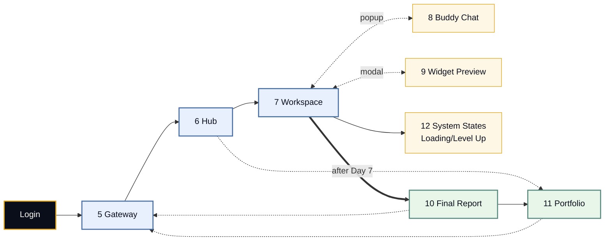

### Navigation Hierarchy cho Admin Side

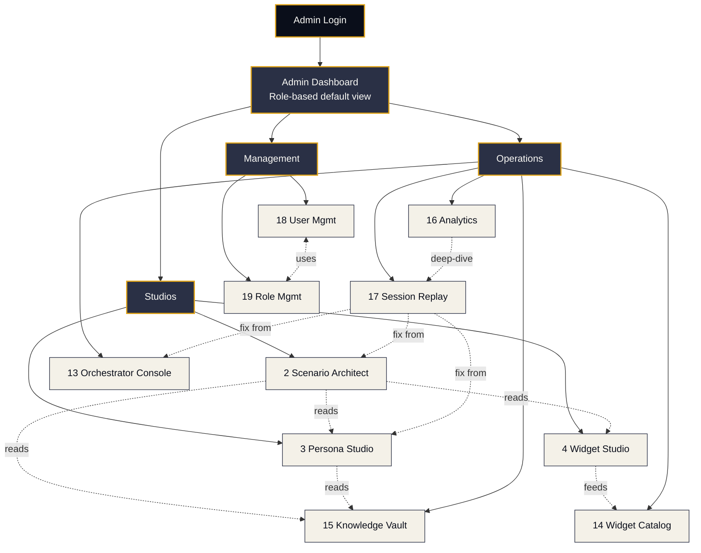

### Navigation Hierarchy cho Parent Side

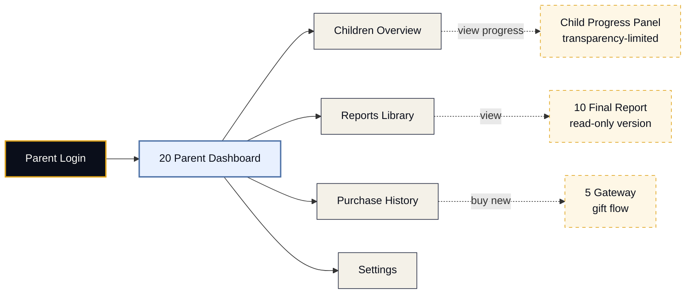

---

## 2. Global Navigation Patterns

### Learner Global Nav (persistent header/sidebar)

```
┌─────────────────────────────────────────────────┐
│  🔥 LUMINA          [Home] [Portfolio] [⚙]  👤 │
└─────────────────────────────────────────────────┘

Sections:
- Home → Hub (current scenario) OR Gateway (no active scenario)
- Portfolio → Screen 11
- Settings → Account settings (not in 20 screens)
- Profile → User avatar + logout
```

### Admin Global Nav (persistent sidebar)

```
┌──────────────────┐
│  🔥 LUMINA       │
│                  │
│  Dashboard       │  ← Home/overview
│  ─────────       │
│  Studios         │
│    Scenarios     │  ← Screen 2
│    Personas      │  ← Screen 3
│    Widgets       │  ← Screen 4
│  ─────────       │
│  Operations      │
│    Orchestrator  │  ← Screen 13
│    Catalog       │  ← Screen 14
│    Knowledge     │  ← Screen 15
│    Analytics     │  ← Screen 16
│    Replay        │  ← Screen 17
│  ─────────       │
│  Management      │
│    Users         │  ← Screen 18
│    Roles         │  ← Screen 19
│                  │
│  [Help]          │
│  [Logout]        │
└──────────────────┘

Visibility rules:
- Hide entire Studios section if no studio-related permissions
- Hide Operations if no ops permissions
- Hide Management if no user/role permissions
```

### Parent Global Nav

```
┌─────────────────────────────────────────────────┐
│  🔥 LUMINA          [Dashboard] [Billing] 👤    │
└─────────────────────────────────────────────────┘

Simpler than learner/admin:
- Dashboard → Screen 20 (main view)
- Billing → Payment & subscription
- Profile → Parent profile
```

---

## 3. Permission Matrix

### 3.1 Roles Overview

| Role ID | Display Name | Type | V1 |
|:--|:--|:--|:--:|
| `super_admin` | Super Admin | Internal | ✅ |
| `designer` | Scenario Designer | Internal | ✅ |
| `persona_writer` | AI Persona Writer | Internal | ✅ |
| `engineer` | Widget Engineer | Internal | ✅ |
| `curator` | Curriculum Expert | Internal | ✅ |
| `operator` | Operations Manager | Internal | ✅ |
| `learner` | Student | External | ✅ |
| `parent` | Parent/Guardian | External | ✅ |

### 3.2 Screen Access Matrix

**Legend:**
- ✅ Full access
- 👁️ View only (read-only)
- 🔐 Conditional access (depends on context)
- ❌ No access

| # | Screen | super_admin | designer | persona_writer | engineer | curator | operator | learner | parent |
|:--|:--|:-:|:-:|:-:|:-:|:-:|:-:|:-:|:-:|
| 1 | Design System | ✅ | 👁️ | 👁️ | 👁️ | 👁️ | 👁️ | ❌ | ❌ |
| 2 | Scenario Architect | ✅ | ✅ | 👁️ | 👁️ | 👁️ | 👁️ | ❌ | ❌ |
| 3 | Persona Studio | ✅ | 👁️ | ✅ | ❌ | 👁️ | 👁️ | ❌ | ❌ |
| 4 | Widget Studio | ✅ | 👁️ | ❌ | ✅ | ❌ | 👁️ | ❌ | ❌ |
| 5 | Gateway | ✅ | 👁️ | 👁️ | 👁️ | 👁️ | 👁️ | ✅ | 🔐 |
| 6 | Hub/Dashboard | ✅ | ❌ | ❌ | ❌ | ❌ | 👁️ | ✅ | 🔐 |
| 7 | Workspace | ✅ | 🔐 | 🔐 | 🔐 | ❌ | 🔐 | ✅ | ❌ |
| 8 | Buddy Chat | ✅ | ❌ | 🔐 | ❌ | ❌ | 🔐 | ✅ | ❌ |
| 9 | Widget Preview | ✅ | ✅ | 👁️ | ✅ | 👁️ | 👁️ | ✅ | ❌ |
| 10 | Final Report | ✅ | 👁️ | 👁️ | ❌ | 👁️ | 👁️ | ✅ | 🔐 |
| 11 | Portfolio | ✅ | ❌ | ❌ | ❌ | ❌ | 👁️ | ✅ | 🔐 |
| 12 | System States | ✅ | 👁️ | 👁️ | 👁️ | ❌ | 👁️ | ✅ | ❌ |
| 13 | Orchestrator Console | ✅ | 👁️ | ✅ | ❌ | ❌ | 👁️ | ❌ | ❌ |
| 14 | Widget Catalog | ✅ | ✅ | 👁️ | ✅ | 👁️ | 👁️ | ❌ | ❌ |
| 15 | Knowledge Vault | ✅ | 👁️ | 👁️ | ❌ | ✅ | 👁️ | ❌ | ❌ |
| 16 | Analytics Dashboard | ✅ | 🔐 | 🔐 | 🔐 | 👁️ | ✅ | ❌ | ❌ |
| 17 | Session Replay | ✅ | 🔐 | 🔐 | 🔐 | ❌ | ✅ | ❌ | ❌ |
| 18 | User & Workspace Mgmt | ✅ | ❌ | ❌ | ❌ | ❌ | ✅ | ❌ | ❌ |
| 19 | Role & Permission Mgmt | ✅ | ❌ | ❌ | ❌ | ❌ | ❌ | ❌ | ❌ |
| 20 | Parent Dashboard | ✅ | ❌ | ❌ | ❌ | ❌ | 🔐 | ❌ | ✅ |

### 3.3 Conditional Access Rules

**Screen 5 (Gateway) — Parent:**
- View-only mode khi mua scenarios cho con
- Không trải nghiệm scenarios directly

**Screen 6 (Hub) — Parent:**
- Thấy được Hub của con nếu transparency level >= Standard
- Không tương tác được

**Screen 7 (Workspace) — Internal roles:**
- `designer`: Access trong playtest mode của scenarios mình đang design
- `persona_writer`: Access trong test mode để xem persona hoạt động
- `engineer`: Access trong widget integration testing
- `operator`: Access khi debug issues

**Screen 8 (Buddy Chat) — Internal roles:**
- `persona_writer`: Access trong playground testing của Chip persona
- `operator`: Access khi debug conversation issues

**Screen 10 (Final Report) — Parent:**
- Thấy được reports của con nếu transparency level >= Standard
- Minimal transparency: chỉ thấy fact rằng report đã generated, không xem nội dung

**Screen 11 (Portfolio) — Parent:**
- Thấy list của scenarios completed
- Click vào report → apply Rule cho Screen 10

**Screen 16 (Analytics) — Internal roles:**
- `designer`: Chỉ analytics của scenarios mình design
- `persona_writer`: Chỉ analytics của personas mình tạo
- `engineer`: Chỉ analytics của widgets mình build

**Screen 17 (Session Replay) — Internal roles:**
- `designer`: Anonymized Replay của scenarios mình design
- `persona_writer`: Anonymized Replay focus vào persona interactions
- `engineer`: Anonymized Replay focus vào widget behavior
- `operator`: Full Replay cho incident investigation
- `super_admin`: Full Replay always

**Screen 20 (Parent Dashboard) — Operator:**
- Conditional access cho support purposes
- Khi parent report issue, operator có thể xem parent dashboard trong read-only + audit mode

### 3.4 Action-Level Permissions

Ngoài screen access, mỗi màn có actions cần permissions riêng:

#### Screen 2 (Scenario Architect)

| Action | super_admin | designer | Notes |
|:--|:-:|:-:|:--|
| Create new scenario | ✅ | ✅ | Both |
| Edit scenario | ✅ | 🔐 | Designer: chỉ scenarios mình tạo hoặc được assign |
| Delete scenario | ✅ | ❌ | Super Admin only |
| Publish to production | ✅ | ❌ | Super Admin only |
| Rollback | ✅ | ❌ | Super Admin only |
| Playtest | ✅ | ✅ | Both |
| Export YAML | ✅ | ✅ | Both |
| Import YAML | ✅ | ✅ | Both (with validation) |

#### Screen 3 (Persona Studio)

| Action | super_admin | persona_writer | Notes |
|:--|:-:|:-:|:--|
| Create persona | ✅ | ✅ | Both |
| Edit personality | ✅ | 🔐 | Writer: chỉ personas mình tạo |
| Edit system prompt | ✅ | 🔐 | Writer: own personas |
| Test in playground | ✅ | ✅ | Both |
| Deploy to registry | ✅ | ❌ | Super Admin approval required |
| Adversarial test | ✅ | ✅ | Both |
| Create variant | ✅ | ✅ | Both |

#### Screen 4 (Widget Studio)

| Action | super_admin | engineer | Notes |
|:--|:-:|:-:|:--|
| Create widget | ✅ | ✅ | Both |
| Edit manifest | ✅ | 🔐 | Engineer: own widgets |
| Build visual shell | ✅ | ✅ | Both |
| Run tests | ✅ | ✅ | Both |
| Deploy to staging | ✅ | ✅ | Both |
| Deploy to production | ✅ | ❌ | Super Admin only |
| Emergency rollback | ✅ | ❌ | Super Admin only |

#### Screen 18 (User Management)

| Action | super_admin | operator | Notes |
|:--|:-:|:-:|:--|
| View user list | ✅ | ✅ | Both |
| Invite user | ✅ | ✅ | Both |
| Assign role | ✅ | 🔐 | Operator: chỉ roles low-tier |
| Remove role | ✅ | 🔐 | Operator: not super_admin role |
| Suspend user | ✅ | ✅ | Both |
| Delete user | ✅ | ❌ | Super Admin only |
| View audit log | ✅ | ✅ | Both |

---

## 4. Data Flow Diagrams

### 4.1 Scenario Execution Data Flow

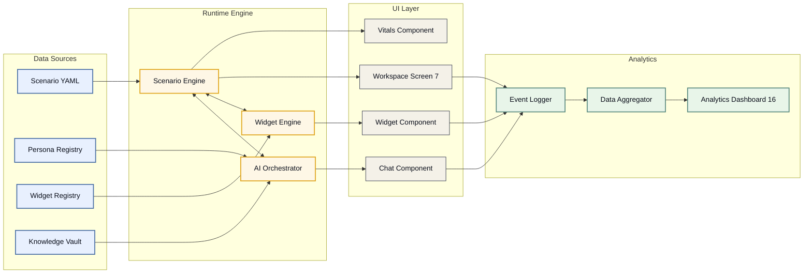

### 4.2 AI Orchestration Data Flow

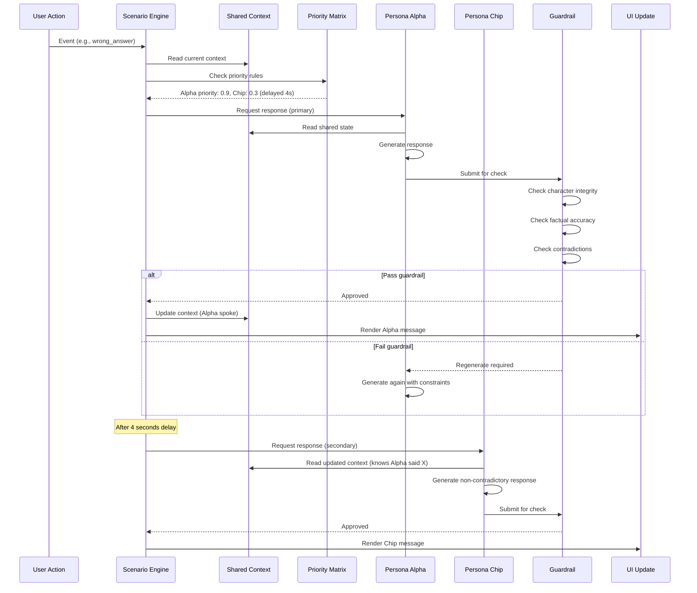

### 4.3 Analytics Data Flow

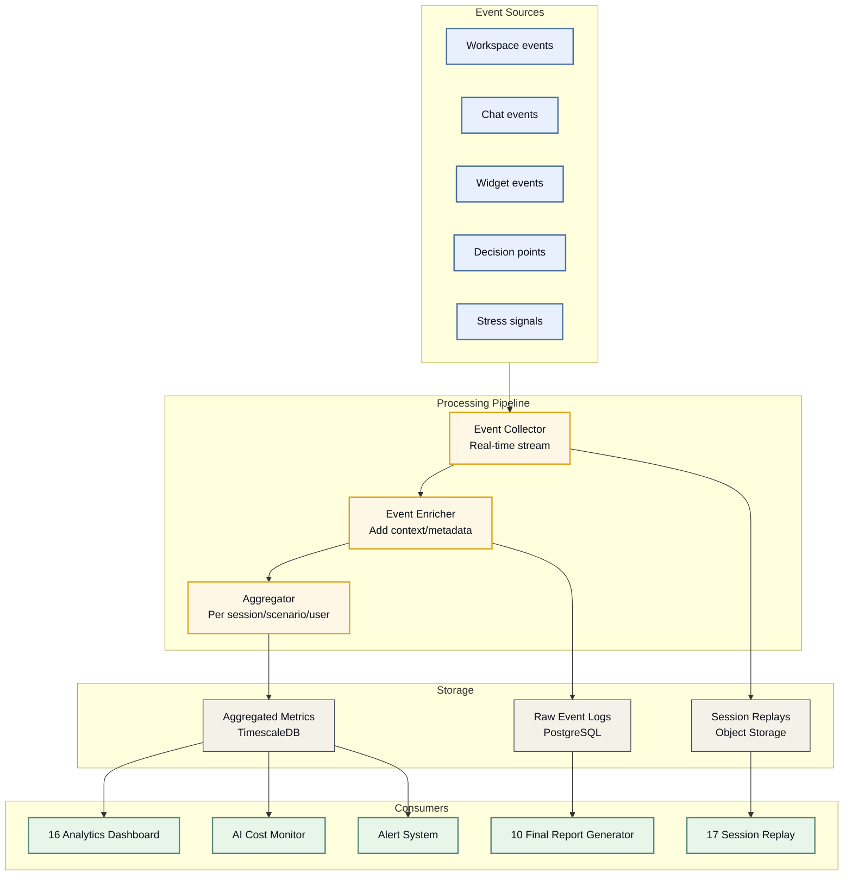

### 4.4 Parent-Child Data Privacy Flow

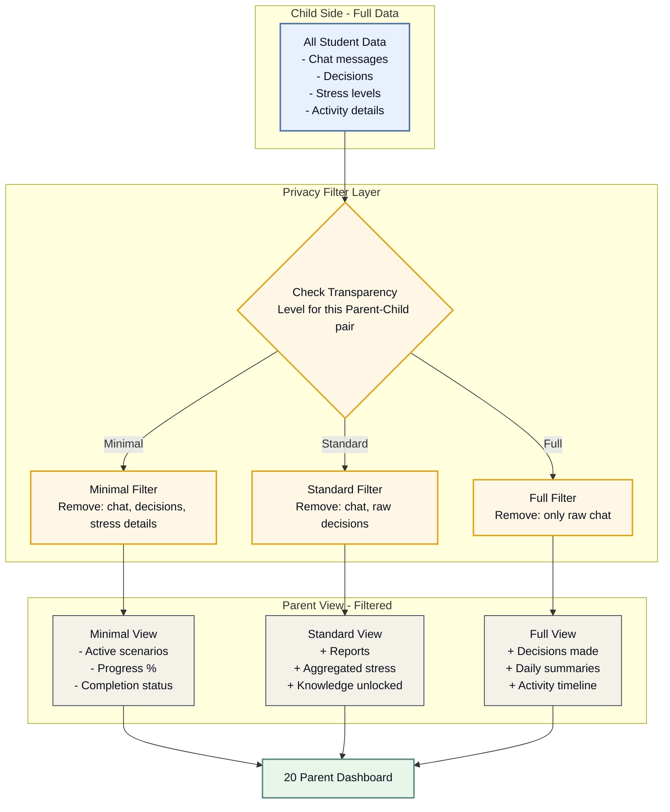

---

## 5. Screen Dependency Map

### 5.1 Hard Dependencies (Must exist before another works)

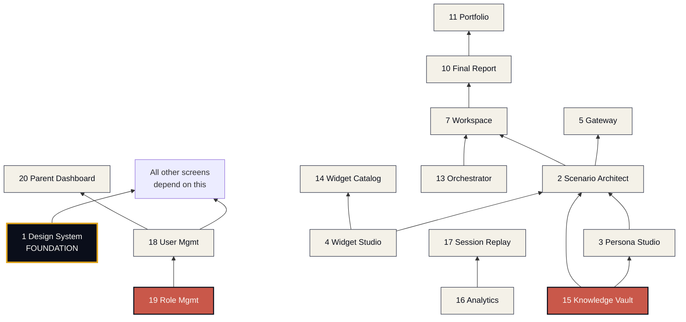

### 5.2 Dependency Analysis

**Critical path cho V1 launch:**

```
Design System (1) 
  → Role Mgmt (19) + User Mgmt (18) 
    → Scenario Architect (2) + Persona Studio (3) + Widget Studio (4) + Knowledge Vault (15)
      → Widget Catalog (14) + Orchestrator (13)
        → Gateway (5) + Hub (6) + Workspace (7)
          → Buddy Chat (8) + Widget Preview (9) + System States (12)
            → Final Report (10) + Portfolio (11)
              → Analytics (16) + Session Replay (17)
                → Parent Dashboard (20)
```

**Parallel tracks (can build concurrently):**

**Track A - Admin content creation:**
- Scenario Architect (2)
- Persona Studio (3)
- Widget Studio (4)
- Knowledge Vault (15)

**Track B - Learner experience:**
- Gateway (5)
- Hub (6)
- Workspace (7)
- Buddy Chat (8)

**Track C - Admin operations:**
- Orchestrator (13)
- Analytics (16)
- Session Replay (17)

**Track D - Management:**
- User Management (18)
- Role Management (19)

### 5.3 Breaking Change Impact Analysis

**Nếu thay đổi Design System (Screen 1):**
- Impact: TẤT CẢ màn hình
- Mitigation: Semantic versioning, backward compatibility
- Communication: Design team lead + all frontend devs

**Nếu thay đổi Scenario Architect (Screen 2):**
- Impact: Screen 7 (Workspace) behavior
- Secondary: Screen 10 (Report), Screen 17 (Replay)
- Mitigation: Schema versioning cho YAML output

**Nếu thay đổi Persona Studio (Screen 3):**
- Impact: Screen 7 (Workspace) AI interactions
- Secondary: Screen 13 (Orchestrator), Screen 16 (Analytics)
- Mitigation: Persona versioning, canary deployment

**Nếu thay đổi Widget Studio (Screen 4):**
- Impact: Screen 7 (Workspace) widget rendering
- Secondary: Screen 9 (Preview), Screen 14 (Catalog)
- Mitigation: Widget contract stability, version pinning

**Nếu thay đổi User/Role Management (Screen 18/19):**
- Impact: Tất cả permission checks
- Mitigation: Database migration careful, audit log

---

## 6. Cross-Role Transition Patterns

### 6.1 Learner → Parent Touch Points

Khi nào Parent "thấy" Learner's data:

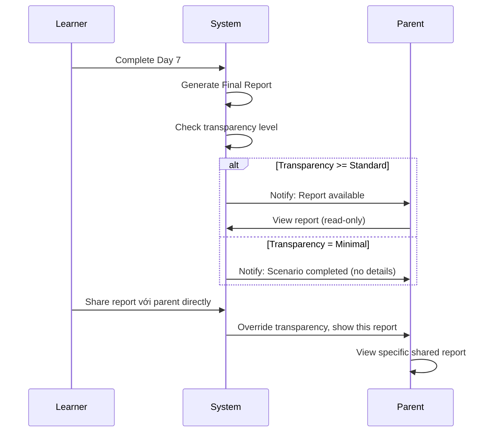

### 6.2 Admin → Learner Data Flow

Khi admin cần access learner's session:

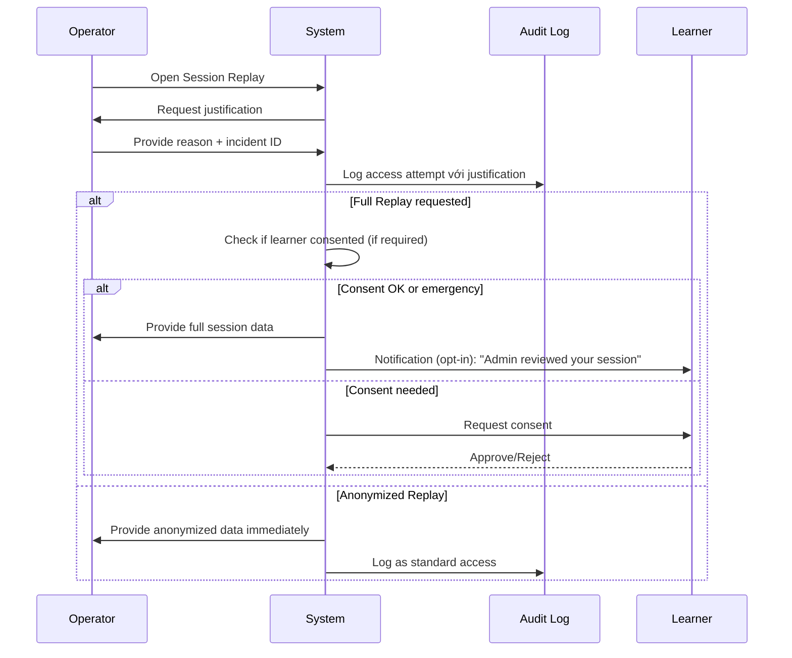

---

## 7. Dashboard Customization per Role

Mỗi role có default dashboard view khác nhau:

### Super Admin Dashboard
```yaml
default_widgets:
  - system_health_overview
  - active_users_realtime
  - revenue_today
  - critical_alerts
  - recent_audit_events
  - scenarios_published_this_week
  - ai_cost_monitor
```

### Designer Dashboard
```yaml
default_widgets:
  - my_scenarios_in_progress
  - scenarios_needing_review
  - recent_designer_activity_team
  - my_scenario_performance_stats
  - pending_persona_requests
  - pending_widget_requests
```

### Persona Writer Dashboard
```yaml
default_widgets:
  - my_personas_in_progress
  - personas_needing_testing
  - persona_performance_metrics
  - hallucination_reports_for_my_personas
  - testing_queue
  - shared_context_issues
```

### Widget Engineer Dashboard
```yaml
default_widgets:
  - my_widgets_in_progress
  - widget_performance_metrics
  - integration_status
  - bug_reports_for_my_widgets
  - deployment_queue
  - test_coverage_stats
```

### Curator Dashboard
```yaml
default_widgets:
  - knowledge_cards_pending_review
  - outdated_content_alerts
  - card_usage_statistics
  - recent_curator_activity_team
  - curriculum_gaps_detected
```

### Operator Dashboard
```yaml
default_widgets:
  - system_health_overview
  - user_activity_metrics
  - support_ticket_queue
  - recent_incidents
  - user_behavior_anomalies
  - cost_monitoring
  - usage_analytics
```

### Learner Dashboard (= Hub, Screen 6)
```yaml
default_widgets:
  - current_scenario_timeline
  - next_day_preview
  - knowledge_cards_collected
  - buddy_status
  - recent_achievements
```

### Parent Dashboard (= Screen 20)
```yaml
default_widgets:
  - children_overview_cards
  - recent_activity_filtered_by_transparency
  - pending_purchases
  - upcoming_reports
  - parental_tips
  - billing_summary
```

---

## 8. Tổng kết

### 8.1 Screen Categories Summary

| Category | Screens | Count |
|:--|:--|:-:|
| **Foundation** | 1 | 1 |
| **Admin Studios** | 2, 3, 4 | 3 |
| **Learner Experience** | 5, 6, 7, 8, 9, 10, 11, 12 | 8 |
| **Admin Operations** | 13, 14, 15, 16, 17 | 5 |
| **Management** | 18, 19 | 2 |
| **Parent** | 20 | 1 |
| **Total** | | **20** |

### 8.2 Complexity Ranking (for build planning)

**High complexity (⭐⭐⭐⭐⭐):**
- Screen 2: Scenario Architect (flow-based editor)
- Screen 7: Workspace (3-zone layout + real-time AI)
- Screen 17: Session Replay (time-travel tool)

**Medium-High complexity (⭐⭐⭐⭐):**
- Screen 3: Persona Studio (5 layers + playground)
- Screen 4: Widget Studio (multi-approach builder)
- Screen 10: Final Report (data viz + narrative)
- Screen 13: Orchestrator Console (Priority Matrix config)
- Screen 16: Analytics Dashboard (many widgets)

**Medium complexity (⭐⭐⭐):**
- Screen 5: Gateway (rich cards + filters)
- Screen 6: Hub/Dashboard (timeline + status)
- Screen 14: Widget Catalog (dependencies view)
- Screen 15: Knowledge Vault (CMS)
- Screen 18: User Management
- Screen 20: Parent Dashboard

**Lower complexity (⭐⭐):**
- Screen 1: Design System (showcase)
- Screen 8: Buddy Chat (focused chat UI)
- Screen 9: Widget Preview (embedded widget view)
- Screen 11: Portfolio (gallery style)
- Screen 12: System States (transitions)
- Screen 19: Role Management (forms + matrix)

### 8.3 Recommended Build Order

Dựa trên dependency + complexity + business value:

**Sprint 1 (Weeks 1-4) - Foundation:**
- Screen 1: Design System finalization
- Screen 19: Role Management
- Screen 18: User Management

**Sprint 2 (Weeks 5-8) - Studios Foundation:**
- Screen 15: Knowledge Vault
- Screen 3: Persona Studio
- Screen 4: Widget Studio

**Sprint 3 (Weeks 9-12) - Scenario Building:**
- Screen 2: Scenario Architect
- Screen 14: Widget Catalog
- Screen 13: Orchestrator Console

**Sprint 4 (Weeks 13-16) - Learner Experience:**
- Screen 5: Gateway
- Screen 6: Hub/Dashboard
- Screen 7: Workspace (most critical)

**Sprint 5 (Weeks 17-20) - Learner Completion:**
- Screen 8: Buddy Chat
- Screen 9: Widget Preview
- Screen 12: System States
- Screen 10: Final Report
- Screen 11: Portfolio

**Sprint 6 (Weeks 21-24) - Admin Operations + Parent:**
- Screen 16: Analytics Dashboard
- Screen 17: Session Replay
- Screen 20: Parent Dashboard

**Sprint 7 (Weeks 25-28) - Integration + Polish:**
- End-to-end testing
- Performance optimization
- Bug fixes
- Launch prep

### 8.4 Key Design Decisions Summary

| Decision | Value |
|:--|:--|
| **Architecture** | Component-based, data-driven rendering |
| **Navigation** | Role-specific global nav |
| **Permissions** | RBAC với multi-role support |
| **Workspace layout** | 3-zone (Communication / Execution / Vitals) |
| **Parent access** | Separate account + 3 transparency levels |
| **Data privacy** | Filter layer based on transparency rules |
| **Session Replay** | 3 access levels (Full/Anonymized/Aggregated) |
| **Dashboard** | Customized per role, widgets-based |
