# Flow 01 — Khám phá & Chọn ngành

**Loại flow:** Learner Journey — First-time  
**Actor:** Học sinh mới (chưa có tài khoản hoặc lần đầu sử dụng)  
**Mục tiêu:** Từ biết đến LUMINA → bắt đầu trải nghiệm Day 1 của một ngành

---

## Main Flow Diagram

```mermaid
flowchart TD
    Start([Người dùng biết đến LUMINA<br/>từ quảng cáo/giới thiệu]) --> Landing[Landing Page]
    
    Landing --> HasAccount{Đã có<br/>tài khoản?}
    
    HasAccount -->|Chưa| SignUp[Sign Up<br/>Email/Google/Phone]
    HasAccount -->|Rồi| Login[Login]
    
    SignUp --> Verify[Verify Email/Phone]
    Verify --> Onboarding1[Onboarding Step 1<br/>Chào mừng & Giới thiệu]
    
    Login --> CheckStatus{User có<br/>subscription?}
    CheckStatus -->|Free| FreeGateway[Gateway - Free Tier<br/>Chỉ xem được Day 1 miễn phí]
    CheckStatus -->|Paid| PaidGateway[Gateway - Full Access]
    
    Onboarding1 --> Onboarding2[Onboarding Step 2<br/>Trắc nghiệm 5 câu về sở thích]
    Onboarding2 --> Onboarding3[Onboarding Step 3<br/>Gợi ý 3 ngành phù hợp]
    Onboarding3 --> FreeGateway
    
    FreeGateway --> BrowseMajors[Browse danh sách ngành<br/>với preview info]
    PaidGateway --> BrowseMajors
    
    BrowseMajors --> MajorDetail[Xem chi tiết ngành<br/>- Độ khó<br/>- Tỷ lệ vỡ mộng<br/>- Preview Day 1]
    
    MajorDetail --> Decision{Quyết định<br/>trải nghiệm?}
    
    Decision -->|Không, xem ngành khác| BrowseMajors
    Decision -->|Có, bắt đầu| CheckPayment{Có quyền<br/>truy cập?}
    
    CheckPayment -->|Free + Day 1 free| StartFree[Bắt đầu Day 1<br/>Free Trial]
    CheckPayment -->|Free + cần Paid| PaymentFlow[Payment Flow<br/>$19.99/ngành]
    CheckPayment -->|Đã Paid| StartFull[Bắt đầu Day 1<br/>Full Access]
    
    PaymentFlow --> PaymentSuccess{Thanh toán<br/>thành công?}
    PaymentSuccess -->|Không| PaymentFail[Error: Retry hoặc chọn ngành khác]
    PaymentFail --> BrowseMajors
    PaymentSuccess -->|Có| StartFull
    
    StartFree --> PreDay1[Pre-Day 1 Setup<br/>- Meet AI Buddy Chip<br/>- Tour nhanh Workspace<br/>- Set expectations]
    StartFull --> PreDay1
    
    PreDay1 --> Day1[Enter Day 1 Workspace<br/>Chính thức bắt đầu trải nghiệm]
    
    Day1 --> End([Hết flow - chuyển sang<br/>Flow 02: Trải nghiệm một ngày])
    
    classDef startEnd fill:#0A0E1A,stroke:#DFA319,stroke-width:2px,color:#FBFAF6
    classDef decision fill:#FEF7E6,stroke:#DFA319,stroke-width:2px,color:#0A0E1A
    classDef process fill:#F4F1E8,stroke:#2A3045,stroke-width:1px,color:#0A0E1A
    classDef error fill:#FCE9E9,stroke:#C9584A,stroke-width:2px,color:#0A0E1A
    
    class Start,End startEnd
    class HasAccount,CheckStatus,Decision,CheckPayment,PaymentSuccess decision
    class Landing,SignUp,Login,Verify,Onboarding1,Onboarding2,Onboarding3,FreeGateway,PaidGateway,BrowseMajors,MajorDetail,PaymentFlow,StartFree,StartFull,PreDay1,Day1 process
    class PaymentFail error
```

---

## Mô tả chi tiết các bước

### Bước 1: Landing Page
**Mục đích:** Giới thiệu LUMINA, thu hút click "Try Now"

**Components chính:**
- Hero section với tagline: *"Sai thử ở đây, đúng cả cuộc đời"*
- Demo video 60s về trải nghiệm SE Day 3 (Khủng hoảng)
- Social proof: testimonials từ học sinh + phụ huynh
- Statistics: "X học sinh đã tránh chọn sai ngành nhờ LUMINA"
- CTA buttons: "Dùng thử miễn phí" / "Xem báo cáo mẫu"

**Quyết định của người dùng:** Sign up mới hay login?

### Bước 2a: Sign Up (User mới)
**Options:**
- Email + password
- Google OAuth  
- Phone (SMS OTP) — Việt Nam market

**Yêu cầu:**
- Nếu user < 18 tuổi: cần thêm email phụ huynh (COPPA compliance)
- Chấp nhận Terms of Service + Privacy Policy

### Bước 2b: Login (User cũ)
**Check status:**
- Free tier: Chỉ access Day 1 của mỗi ngành
- Paid (per-scenario): Access full 7 ngày của các ngành đã mua
- Subscription (V2+): Access tất cả ngành

### Bước 3: Onboarding (Chỉ cho user mới)

**Step 1: Welcome**
- Giải thích LUMINA là gì
- Khác biệt với các khóa học online thông thường
- Lời hứa: "Trong 7 ngày, bạn sẽ biết mình có hợp ngành X hay không"

**Step 2: Interest Assessment**
- 5 câu hỏi nhanh về:
  - Sở thích hiện tại (math, văn, nghệ thuật, xã hội...)
  - Điểm mạnh tự nhận
  - Ngành đang cân nhắc (nếu có)
  - Điều gì lo ngại nhất về chọn ngành
  - Thời gian có thể dành/tuần

**Step 3: Personalized Recommendation**
- AI phân tích → gợi ý 3 ngành phù hợp nhất (ưu tiên hiển thị)
- Giải thích lý do tại sao gợi ý từng ngành

### Bước 4: Gateway (Browse ngành)
→ Xem chi tiết màn hình: **Gateway (Screen 5)**

**Với Free user:**
- Tất cả ngành hiển thị
- Chỉ ngành đã gợi ý có nút "Try Day 1 Free"
- Các ngành khác hiển thị "Unlock $19.99"

**Với Paid user:**
- Ngành đã mua hiển thị "Continue" (nếu đang làm)
- Ngành mới hiển thị "Start" (nếu có subscription) hoặc "Buy"

### Bước 5: Major Detail
Học sinh click vào một ngành → xem chi tiết:
- **Độ khó**: 4/5 sao
- **Tỷ lệ vỡ mộng thực tế**: 60%
- **Ai phù hợp với ngành này**: mô tả tính cách, kỹ năng
- **Preview**: 3 tình huống chính sẽ gặp trong 7 ngày
- **Career paths**: Các nghề cụ thể sau khi học

### Bước 6: Payment Flow (Nếu cần)

**Trigger:** User muốn access full 7 ngày của ngành chưa mua

**Steps:**
1. Chọn gói: Single scenario ($19.99) hoặc Monthly subscription (V2+)
2. Chọn phương thức: VNPay, MoMo, Credit card, Bank transfer
3. Nhập thông tin payment
4. Confirm & Pay
5. Receive receipt via email

**Edge cases:**
- Payment fail: Show error, offer retry hoặc chọn ngành khác
- Network timeout: Save payment intent, retry sau
- Phụ huynh pay dùm: Gửi link payment qua email

### Bước 7: Pre-Day 1 Setup

**Mục đích:** Đảm bảo học sinh biết cách dùng trước khi vào Workspace "thật"

**Components:**
- **Meet your Buddy**: Chip giới thiệu bản thân, giải thích vai trò
- **Quick Tour**: Highlight 3-zone layout (Chat left, Widget center, Vitals right)
- **Set Expectations**: "Trong 7 ngày, có những lúc bạn sẽ thấy khó. Đó là bình thường. Hãy nhớ..."
- **Consent confirmation**: "Tôi hiểu đây là mô phỏng, kết quả sẽ giúp tôi hiểu bản thân"

### Bước 8: Enter Day 1 Workspace
→ Chuyển sang **Flow 02: Trải nghiệm một ngày**

---

## Edge Cases & Alternative Paths

### Case 1: User bỏ cuộc giữa onboarding
**Trigger:** Đóng tab / idle > 10 phút  
**Behavior:** 
- Save progress ở step đã làm
- Email nhắc nhở sau 24h: "Bạn chỉ còn 2 bước là có thể bắt đầu!"
- Lần login sau: resume từ step đó

### Case 2: Free user đã dùng Day 1 của ngành, muốn tiếp tục
**Flow:**
- Hiện paywall đẹp, không aggressive
- "Bạn đã hoàn thành Day 1. Để tiếp tục Day 2-7 và nhận báo cáo Career-Fit, hãy upgrade."
- 2 options: Pay per-scenario ($19.99) hoặc Subscribe (V2+)

### Case 3: Phụ huynh mua cho con
**Flow:**
- Phụ huynh tạo account parent
- Mua "Gift Scenario" → nhận code
- Gửi code cho con
- Con tạo account student, nhập code để unlock

### Case 4: Student < 13 tuổi (trẻ vị thành niên)
**Blocked flow:** Không cho sign up nếu khai dưới 13 tuổi (COPPA)

### Case 5: User quay lại sau nhiều tháng
**Flow:**
- Welcome back modal: "Bạn đã bỏ giữa Day 3 của ngành SE"
- Options: Resume / Restart scenario / Pick new major

---

## Screens liên quan

| Screen | Vai trò trong flow |
|:--|:--|
| **Landing Page** (ngoài 18 màn V1, là marketing page) | Giới thiệu LUMINA |
| **Sign Up / Login** (không trong 18 màn, handled by auth system) | Authentication |
| **Onboarding** (có thể gộp với System States - Screen 12) | 3 steps onboarding |
| **Gateway (Screen 5)** | Browse và chọn ngành |
| **Major Detail** (phần của Gateway) | Xem chi tiết ngành |
| **Payment Flow** (ngoài 18 màn, là payment integration) | Thanh toán |
| **Pre-Day 1 Setup** (có thể là System State của Screen 12) | Tour & setup |
| **Workspace (Screen 7)** | Bắt đầu Day 1 |

---

## Permission Requirements

Flow này không có permission check phức tạp (vì là học sinh end-user):
- **Anonymous**: Chỉ xem Landing Page
- **Authenticated Free**: Gateway + Day 1 Free
- **Authenticated Paid**: Full access scenarios đã mua

---

## Metrics cần track

- **Conversion funnel:**
  - Landing → Sign Up: target >15%
  - Sign Up → Complete Onboarding: target >80%
  - Onboarding → Browse Major: target >95%
  - Major Detail → Start Day 1: target >40%
  - Free Day 1 → Pay for full: target >15%

- **Drop-off points:**
  - Step nào nhiều người bỏ cuộc nhất?
  - Thời gian trung bình từ Landing → Day 1?

---

## Tóm tắt

| Khía cạnh | Chi tiết |
|:--|:--|
| **Tổng số bước chính** | 8 |
| **Decision points** | 4 (có account, subscription, quyết định, payment) |
| **Screens đi qua** | 6-8 |
| **Thời gian trung bình** | 5-10 phút (nếu không payment) |
| **Flow tiếp theo** | Flow 02: Trải nghiệm một ngày |
