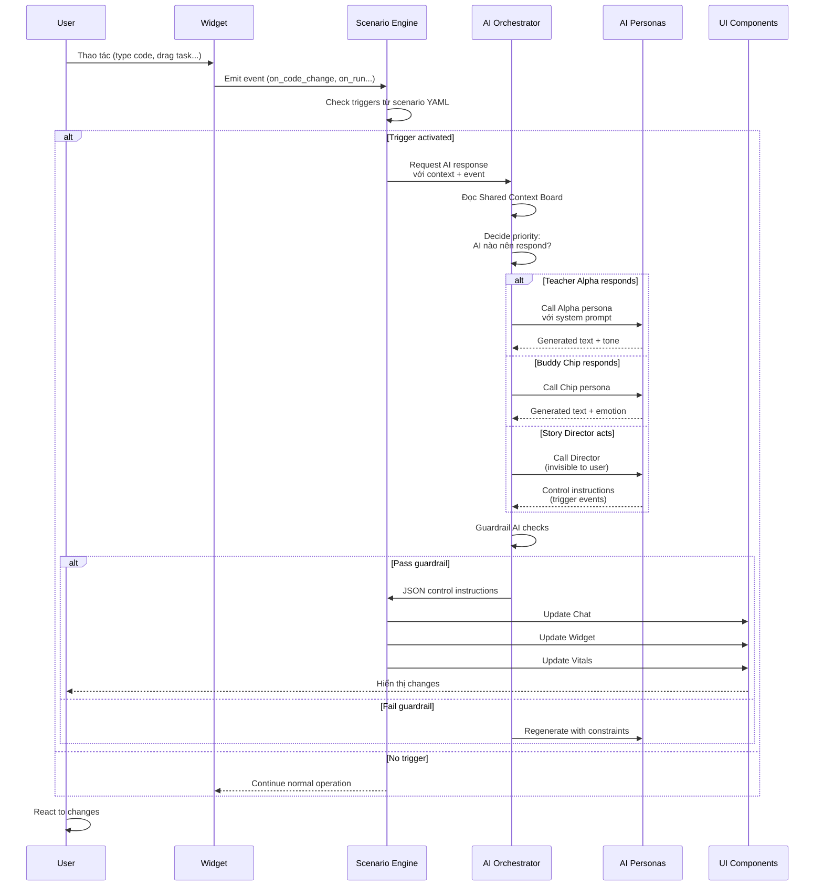

# Flow 02 — Trải nghiệm một ngày

**Loại flow:** Learner Journey — Daily Loop  
**Actor:** Học sinh đang trải nghiệm kịch bản  
**Mục tiêu:** Từ vào Hub buổi sáng → hoàn thành nhiệm vụ của ngày → quay về Hub  
**Context:** Đây là flow xảy ra 7 lần (mỗi ngày trong kịch bản 7 ngày)

---

## Main Flow Diagram

```mermaid
flowchart TD
    Enter([Học sinh login hoặc resume]) --> Hub[Hub/Dashboard<br/>Timeline 7 ngày]
    
    Hub --> CheckUnlock{Day hôm nay<br/>đã unlock?}
    
    CheckUnlock -->|Chưa đến thời gian| LockedView[Locked Day View<br/>Countdown đến next day]
    CheckUnlock -->|Đã unlock| DayPreview[Day Preview<br/>- Theme của ngày<br/>- Goal<br/>- Estimated time]
    
    LockedView --> OtherActions{Học sinh<br/>muốn gì?}
    OtherActions -->|Xem kiến thức đã học| Portfolio[Portfolio/Archive<br/>Review knowledge cards]
    OtherActions -->|Chat với Buddy| BuddyChat[Buddy Chat<br/>Casual conversation]
    OtherActions -->|Thoát| Exit([Log out])
    
    DayPreview --> StartDay[Click Start Day N]
    
    StartDay --> LoadingScene[Loading Transition<br/>'Đang thiết lập môi trường...']
    LoadingScene --> EnterWorkspace[Enter Workspace]
    
    EnterWorkspace --> AIIntro[AI Teacher Intro<br/>Giới thiệu bối cảnh ngày]
    
    AIIntro --> MainLoop{MAIN INTERACTION LOOP}
    
    MainLoop --> UserAction[User thao tác<br/>code/drag/chat/click]
    UserAction --> WidgetEvent[Widget emit event]
    WidgetEvent --> ScenarioCheck[Scenario Engine<br/>check triggers]
    
    ScenarioCheck --> TriggerFired{Trigger<br/>activated?}
    
    TriggerFired -->|Không| ContinueLoop[Tiếp tục main loop]
    TriggerFired -->|Có| AIResponse[AI generate response<br/>via Orchestrator]
    
    AIResponse --> ApplyChanges[Apply JSON to UI:<br/>- Chat message<br/>- Widget update<br/>- Vitals change<br/>- Trigger event]
    
    ApplyChanges --> CheckStress{Stress level<br/>> 85%?}
    CheckStress -->|Không| ContinueLoop
    CheckStress -->|Có, consecutive 3 days| DynamicBranch[Dynamic Branching<br/>Early Exit option]
    CheckStress -->|Có, single day| BuddyIntervention[Buddy Intervention<br/>Suggest break]
    
    BuddyIntervention --> UserChoice1{Học sinh<br/>chọn?}
    UserChoice1 -->|Tiếp tục| ContinueLoop
    UserChoice1 -->|Nghỉ| PauseModal[Pause Modal<br/>Save progress]
    PauseModal --> Hub
    
    DynamicBranch --> UserChoice2{Học sinh<br/>chọn?}
    UserChoice2 -->|Tiếp tục| ContinueLoop
    UserChoice2 -->|Dừng kịch bản| BurnoutEnding[Burnout Ending<br/>Final Report]
    
    ContinueLoop --> CheckComplete{Day objectives<br/>hoàn thành?}
    CheckComplete -->|Chưa| MainLoop
    CheckComplete -->|Rồi| DaySummary[Day Summary<br/>- Achievements<br/>- Knowledge unlocked<br/>- Stats của ngày]
    
    DaySummary --> HasBranch{Day này có<br/>branch point?}
    HasBranch -->|Có Day 4 hoặc Day 6| BranchChoice[Branch Point Screen<br/>Technical/Values choice]
    HasBranch -->|Không| DayComplete[Day Complete Celebration<br/>Level up animation]
    
    BranchChoice --> DayComplete
    DayComplete --> CheckLastDay{Day 7?}
    
    CheckLastDay -->|Không| BackToHub[Return to Hub<br/>Next day locked until next morning]
    CheckLastDay -->|Có| FinalReportFlow[Chuyển sang Flow 03<br/>Kết thúc & Nhận báo cáo]
    
    BackToHub --> Hub
    
    BurnoutEnding --> FinalReportFlow
    
    classDef startEnd fill:#0A0E1A,stroke:#DFA319,stroke-width:2px,color:#FBFAF6
    classDef decision fill:#FEF7E6,stroke:#DFA319,stroke-width:2px,color:#0A0E1A
    classDef process fill:#F4F1E8,stroke:#2A3045,stroke-width:1px,color:#0A0E1A
    classDef mainLoop fill:#E8F0FE,stroke:#4A6FA5,stroke-width:2px,color:#0A0E1A
    classDef danger fill:#FCE9E9,stroke:#C9584A,stroke-width:2px,color:#0A0E1A
    
    class Enter,Exit startEnd
    class CheckUnlock,OtherActions,TriggerFired,CheckStress,UserChoice1,UserChoice2,CheckComplete,HasBranch,CheckLastDay decision
    class MainLoop mainLoop
    class Hub,LockedView,DayPreview,StartDay,LoadingScene,EnterWorkspace,AIIntro,UserAction,WidgetEvent,ScenarioCheck,AIResponse,ApplyChanges,ContinueLoop,DaySummary,BranchChoice,DayComplete,BackToHub,Portfolio,BuddyChat,PauseModal process
    class DynamicBranch,BuddyIntervention,BurnoutEnding,FinalReportFlow danger
```



---

## Sub-flow: Main Interaction Loop (Chi tiết hơn)



---

## Mô tả chi tiết các bước

### Bước 1: Entry Point — Hub

Học sinh login (hoặc resume từ session trước) → landing ở **Hub/Dashboard**.

**Hub hiển thị:**
- Timeline 7 ngày (node hình tròn)
  - Days đã hoàn thành: xanh lá
  - Day hiện tại: nhấp nháy vàng (lumina-500)
  - Days chưa unlock: xám + icon khóa
- Current streak: "Bạn đã học 3 ngày liên tiếp!"
- Knowledge cards đã thu thập
- Chip (buddy avatar) vẫy chào

### Bước 2: Check Day Lock

**Logic unlock:**
- Day N+1 unlock sau 18h (hoặc 6h cho Paid Pro)
- Tránh học dồn 7 ngày trong 1 đêm → giảm hiệu quả đánh giá stress

**Nếu chưa unlock:**
- Show countdown: "Day 4 sẽ mở trong 12h 34m"
- Suggest activities khác (Portfolio, Buddy chat, xem progress)

### Bước 3: Day Preview

Trước khi enter Workspace, show overview:

**Components:**
- Theme ngày (VD: "Ngày 3 — Khủng hoảng hệ thống")
- Goal: "Hôm nay đo khả năng ra quyết định dưới áp lực"
- Estimated time: "45-60 phút"
- Warning nếu phù hợp: "Ngày này có cường độ cao. Hãy chuẩn bị tinh thần."

### Bước 4: Loading Transition

**Text cinematic:**
```
Đang thiết lập môi trường Startup...
Đang kết nối với thầy Alpha...
Đang giả lập áp lực deadline...
```

Loading 2-3 giây (có thể preload data thật).

### Bước 5: Enter Workspace + AI Intro

→ Xem chi tiết: **Workspace (Screen 7)**

**AI Teacher phát biểu đầu tiên:**
- Lời chào context-aware (biết hôm nay là day mấy, user đã làm gì hôm qua)
- Giới thiệu nhiệm vụ
- Set expectation

### Bước 6: MAIN INTERACTION LOOP

Đây là phần xảy ra 90% thời lượng. Pattern lặp lại:

```
User thao tác → Widget event → Engine check trigger
     → (có trigger) AI response → UI update
     → User thao tác tiếp
```

**Các trigger phổ biến:**
- Time-based: "Sau 5 phút không hoạt động → Buddy nhắc"
- Event-based: "User click Run → AI review output"
- Error-based: "Wrong answer 3 times → Teacher disappointed"
- Success-based: "Brilliant solution → Teacher raise difficulty"
- State-based: "Stress > 85% → Buddy intervention"

### Bước 7: Stress Monitoring

**Sensors theo dõi liên tục:**
- Typing speed (nhanh đột ngột = stress?)
- Pause duration (dừng lâu = thinking hay bỏ cuộc?)
- Click patterns (nhiều click mạnh = frustration?)
- Chat sentiment (ngôn ngữ negative?)
- Help requests frequency

**Stress level tính toán:**
- Baseline: 0-20%
- Working hard: 40-60%  
- Under pressure: 60-80%
- Critical: 80-100%

**Intervention thresholds:**
- 70%: Buddy gợi ý break (optional)
- 85%: Buddy intervene strongly
- 90% + sustained: Dynamic branching (Early Exit option)
- 3 consecutive days > 85%: Burnout ending tự kích hoạt

### Bước 8: Day Complete

**Conditions để complete:**
- Hoàn thành objectives của ngày (defined in scenario)
- Hoặc đạt thời gian tối thiểu (60 phút) với kết quả acceptable
- Hoặc user chủ động chọn "End Day Early"

**Day Summary Screen:**
- Achievements unlocked
- Knowledge cards unlocked (1-2 cards/ngày)
- Stats: time spent, decisions made, stress peak
- Preview: "Ngày mai bạn sẽ gặp..."

### Bước 9: Branch Point (Day 4 & Day 6)

**Day 4 — Technical Choice:**
- "Bạn muốn chuyên sâu về Frontend hay Backend?"
- 2 options với descriptions
- Track time to decide, hover patterns

**Day 6 — Values Choice:**
- "Sếp bảo kệ lỗi bảo mật để launch đúng hạn. Bạn?"
- 2 options: Ethics first / Deadline first
- Track decision time, stress level during choice

### Bước 10: Day Complete Celebration

**Mini-animation:**
- "Level Up" với confetti vàng (Lumina-500)
- Display: "Day X Complete!"
- Show knowledge cards gained bay vào Portfolio
- Show next day preview (locked)

### Bước 11: Return to Hub

Auto-redirect sau 5 giây, hoặc click "Continue".

**Next day lock:**
- Day tiếp theo hiện countdown
- Email reminder sẽ gửi khi unlock

---

## Edge Cases & Alternative Paths

### Case 1: Network disconnection giữa Workspace
**Behavior:**
- Show banner: "Mất kết nối — Đang save offline"
- Cache state trong localStorage/IndexedDB
- Retry every 30s
- Khi reconnect: sync với server, tiếp tục

### Case 2: Student close tab giữa chừng
**Behavior:**
- Auto-save session state every 10s
- Next login: "Bạn đang ở phút 23 của Day 3. Tiếp tục?"
- Stress level đã accumulate được giữ nguyên

### Case 3: Student muốn "cheat" — dùng Google tra cứu
**Detection:**
- Tab switch detection (visibility API)
- Long pause sau visibility change → flag trong analytics
- Không block (không muốn tạo cảm giác bị giám sát)
- Ghi vào report cuối: "Bạn đã search 5 lần trong Day 3 → có thể cần rèn tư duy độc lập"

### Case 4: Widget crash / AI không respond
**Behavior:**
- Show friendly error: "Chip cần nghỉ xíu, đang reset..."
- Retry 3 times với exponential backoff
- Nếu vẫn fail: save progress, send error log, offer refund/extension

### Case 5: Student bỏ cuộc hoàn toàn (không login 7 ngày)
**Behavior:**
- Email reminder day 2, 5, 7
- Sau 14 ngày: trigger partial report với data đã có
- Scenario đóng lại, có thể restart (mất progress)

### Case 6: Parent vào xem giữa chừng
**Parental access (V1 feature):**
- Parent account linked với student
- View Hub của con (read-only)
- Thấy progress %, current day, last active
- KHÔNG thấy nội dung chat/decisions (privacy của con)
- Nhận notification khi con hoàn thành scenario

---

## Screens liên quan

| Screen | Vai trò trong flow |
|:--|:--|
| **Hub/Dashboard (Screen 6)** | Entry point mỗi ngày |
| **Workspace (Screen 7)** | Main interaction environment |
| **Buddy Chat (Screen 8)** | Popup intervention + casual chat |
| **Portfolio (Screen 11)** | Xem knowledge đã học |
| **System States (Screen 12)** | Loading, Level Up, Pause modal |
| **Branch Point** (state của Workspace) | Day 4, Day 6 decisions |
| **Final Report (Screen 10)** | Khi hoàn thành Day 7 hoặc Burnout |

---

## AI Interactions trong flow này

### Character AI
- **Mr. Alpha (Teacher)**: Xuất hiện Day 2, 4 (lý thuyết); intervene khi user sai nhiều
- **Chip (Buddy)**: Xuyên suốt, thường xuất hiện khi stress cao hoặc off-topic
- **Boss Nam**: Day 3, Day 5, Day 6 — áp lực
- **Client Linh**: Day 5, Day 7 — khó tính

### Director AI
- **Story Director**: Quyết định key events, trigger state changes (invisible)
- **Pressure Controller**: Quản lý stress curve, tránh overwhelm quá sớm

### System AI
- **Guardrail**: Check mỗi response trước khi hiển thị
- **Sentiment Analyzer**: Đọc tin nhắn user để update stress level
- **Report Generator**: Thu thập data cho final report

---

## Data thu thập trong flow

### Behavioral Signals
```yaml
per_interaction:
  - timestamp
  - action_type
  - duration
  - stress_level_snapshot
  - widget_state_snapshot
  
per_decision:
  - decision_point_id
  - options_hover_time
  - time_to_decide
  - final_choice
  - stress_level_during
  
per_day:
  - total_time
  - active_time vs idle_time
  - knowledge_cards_applied
  - help_requests_count
  - restart_count
  - stress_peak
  - stress_average
```

### Analytics events
- `day_start` (day_number, timestamp)
- `widget_interaction` (widget_id, event_name, payload)
- `ai_response` (persona_id, message_length, tone)
- `stress_threshold_crossed` (level, direction)
- `knowledge_card_unlocked` (card_id)
- `day_complete` (day_number, stats)

---

## Tóm tắt

| Khía cạnh | Chi tiết |
|:--|:--|
| **Tần suất flow** | 7 lần/scenario (mỗi ngày 1 lần) |
| **Thời gian trung bình** | 45-90 phút/day |
| **Screens chính** | Hub → Workspace → Day Summary |
| **Main loop complexity** | Cao — xảy ra hàng trăm lần/ngày |
| **Critical paths** | Stress monitoring + Dynamic branching |
| **Flow tiếp theo** | Lặp lại (Day N+1) hoặc Flow 03 (Day 7 complete) |
