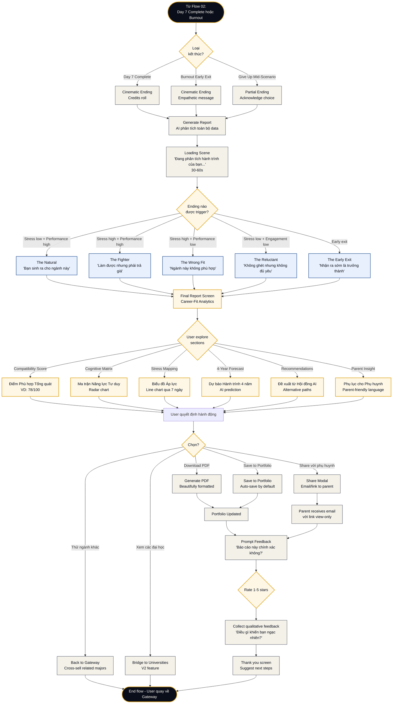

# Flow 03 — Kết thúc kịch bản & Nhận báo cáo

**Loại flow:** Learner Journey — Completion  
**Actor:** Học sinh hoàn thành Day 7 hoặc bị burnout  
**Mục tiêu:** Từ hoàn thành scenario → nhận Career-Fit Report → lưu vào Portfolio → share/continue  
**Context:** Đây là khoảnh khắc "đỉnh cao" của LUMINA — giá trị bán được của sản phẩm

---

## Main Flow Diagram



---

## Mô tả chi tiết các bước

### Bước 1: Ending Detection

Khi scenario kết thúc (cách nào cũng được), Engine chạy **Branch Arbitration Logic**:

```yaml
ending_arbitration:
  inputs:
    - stress_avg
    - stress_peak
    - performance_score
    - engagement_score
    - knowledge_application_rate
    - persistence_score
    - early_exit_flag
    
  output: one_of_5_endings
  
  logic: |
    IF early_exit_flag:
      → The Early Exit (Burnout)
    ELIF stress_avg > 75 AND performance < 50:
      → The Wrong Fit
    ELIF stress_avg < 40 AND performance > 80:
      → The Natural
    ELIF stress_avg > 70 AND performance > 75 AND persistence > 80:
      → The Fighter
    ELIF stress_avg < 50 AND performance < 65 AND engagement < 40:
      → The Reluctant
    ELSE:
      → Fallback to closest ending based on weighted scoring
```

### Bước 2: Cinematic Ending Scene

Khác với UI thông thường, đây là moment **cảm xúc** cao. Full-screen takeover:

**The Natural:**
- Dark background với light rays (Lumina-300 glow)
- Fraunces display font: "The Natural"
- Narrative text fade-in: "Trong 7 ngày, bạn đã chứng minh điều nhiều người mất năm đầu đại học để nhận ra — bạn thuộc về nơi này."
- Subtle ambient sound (optional)

**The Fighter:**
- Warm amber tones
- Title: "The Fighter"
- Narrative: "Bạn đã vượt qua, nhưng không dễ dàng. Hãy cân nhắc thật kỹ — không chỉ về khả năng, mà về cái giá bạn sẵn sàng trả."

**The Wrong Fit:**
- Soft, compassionate tones (không buồn)
- Title: "The Wrong Fit"
- Narrative: "Dữ liệu cho thấy ngành này có thể không phải 'nhà' của bạn. Đây không phải thất bại — đây là thông tin quý giá."

**The Reluctant:**
- Neutral, thoughtful
- Title: "The Reluctant"
- Narrative: "Bạn có thể làm được, nhưng có thể bạn cần tìm điều gì đó khiến tim bạn đập mạnh hơn."

**The Early Exit:**
- Warm, không stigma
- Title: "The Early Exit"  
- Narrative: "Nhận ra mình cần nghỉ ngơi là một dấu hiệu trưởng thành mà nhiều người không có. Bạn đã lắng nghe bản thân — đó là kỹ năng quý nhất."

### Bước 3: Report Generation Loading

Sau ending scene, show loading screen:

**Progressive text reveal:**
```
Đang phân tích 1,247 quyết định bạn đã thực hiện...
Đang đo lường 35 khoảnh khắc áp lực của bạn...
Đang đối chiếu với 4,532 học sinh khác cùng ngành...
Đang chuẩn bị báo cáo dành riêng cho bạn...
```

**Kỹ thuật:**
- Pre-generate data trong lúc animation chạy
- Target time: 30-60 giây (đủ dài để "cảm thấy có giá trị", đủ ngắn để không chán)

### Bước 4: Final Report Screen

→ Xem chi tiết: **Final Report (Screen 10)**

**6 Sections chính:**

#### Section 1: Compatibility Score
```yaml
format: Big number + descriptor
examples:
  - "78/100 — Tiềm năng cao, cần rèn sức bền"
  - "45/100 — Không phù hợp, hãy khám phá khác"
visualization: Circular progress với color gradient
```

#### Section 2: Cognitive Matrix (Ma trận tư duy)
```yaml
format: Radar chart 5 trục
axes:
  - Tư duy hệ thống (0-10)
  - Xử lý dữ liệu nhiễu (0-10)
  - Ra quyết định đạo đức (0-10)
  - Giao tiếp & trình bày (0-10)
  - Chịu đựng áp lực (0-10)
  
with_comparison: So sánh với "average Junior SE" và "average Senior SE"
```

#### Section 3: Stress Mapping
```yaml
format: Line chart qua 7 ngày
data_points:
  - Hourly stress level
  - Peak moments (highlighted)
  - Recovery patterns
  - Critical thresholds crossed
  
annotations:
  - "Day 3, 14:23 — Peak stress 92% khi Server sập"
  - "Day 5, 10:15 — Lowest stress khi làm việc solo"
```

#### Section 4: 4-Year Forecast (AI Prediction)
```yaml
format: Timeline narrative
sections:
  - Year 1-2 (Đại cương):
    prediction: "Bạn sẽ thấy cực kỳ nhàm chán với Toán lý thuyết. 
                Nguy cơ bỏ học ở giai đoạn này là 40%."
  - Year 3-4 (Chuyên ngành):
    prediction: "Bạn sẽ tỏa sáng ở các dự án thực tế và thực tập tại doanh nghiệp."
  - Recommendation:
    text: "Nếu chọn ngành này, bạn cần tìm một nhóm bạn học có tính kỷ luật cao 
          để kéo bạn qua 2 năm đầu."
```

#### Section 5: AI Panel Recommendations
```yaml
format: Cards với 3 options
options:
  - tier: "A (Match cao nhất)"
    major: "Khoa học dữ liệu"
    reason: "Dựa trên kỹ năng phân tích + ít code hơn"
    
  - tier: "B (Ngành lân cận - vùng an toàn)"
    major: "Hệ thống thông tin quản lý"
    reason: "Ít nặng về code hơn, thiên về quản trị"
    
  - tier: "Tránh"
    major: "Nghệ thuật thuần túy"  
    reason: "Dữ liệu cho thấy bạn tìm quy luật thay vì ngẫu hứng"
```

#### Section 6: Parent Insight (Phụ lục phụ huynh)
```yaml
format: Letter-style, parent-friendly language
tone: Professional, không jargon technical
content:
  - Đánh giá tổng quan (1 paragraph)
  - 3 điểm mạnh nổi bật
  - 2 điểm cần hỗ trợ
  - ROI prediction: "Đầu tư ngành này có tỷ lệ hài lòng nghề nghiệp 85%"
  - Advice cho phụ huynh: cách support con
```

### Bước 5: Action Options

Sau khi explore report, user có các options:

**1. Download PDF**
- Generate PDF đẹp, có branding LUMINA
- Include QR code link về web version
- Watermark: "Generated for [Student Name] on [Date]"

**2. Share với Phụ huynh**
- Modal nhập email phụ huynh (hoặc chọn nếu đã link account)
- Parent nhận email với link view-only (không download được original PDF, chỉ xem web)
- Có thể kèm message từ con: "Con đã hoàn thành trải nghiệm ngành SE, đây là báo cáo..."

**3. Save to Portfolio**
- Auto-save by default
- Portfolio = bộ sưu tập reports của nhiều scenarios
- Có thể retake scenario sau này và so sánh

**4. Thử ngành khác (Cross-sell)**
- Based on AI recommendations, show 3 related majors
- "Bạn hợp ngành SE với Fighter profile. Có thể bạn cũng sẽ hợp Data Science?"
- Discount nhẹ cho ngành thứ 2

**5. Bridge to Universities (V2 feature)**
- Show universities có ngành phù hợp
- Filter theo điểm thi dự kiến, học phí, vị trí
- Link tới website tuyển sinh

### Bước 6: Feedback Collection

**Critical data cho LUMINA:**

**Star Rating:**
- "Báo cáo này chính xác với bạn không?" (1-5 stars)

**Qualitative:**
- "Điều gì trong báo cáo khiến bạn ngạc nhiên nhất?"
- "Điều gì bạn nghĩ báo cáo đã sai?"
- "Sau trải nghiệm này, quyết định của bạn về ngành là gì?"

**6-Month Follow-up (V2):**
- Email sau 6 tháng: "Bạn đã chọn ngành gì? Báo cáo có đúng không?"
- Data này cực quý cho việc calibrate hệ thống

### Bước 7: Thank You & Next Steps

**Closing screen:**
- Thank you message personalized
- "Bạn đã thuộc về 15,234 học sinh đã tìm thấy hướng đi"
- Suggested next actions:
  - Thử ngành thứ 2 với discount
  - Chia sẻ trải nghiệm trên social media (với privacy)
  - Join community (V2+)

---

## Edge Cases & Alternative Paths

### Case 1: Student không muốn xem report ngay
**Flow:**
- Save report, send email với link
- "Bạn có thể xem lại bất cứ lúc nào từ Portfolio"

### Case 2: Student tranh cãi với kết quả
**Flow:**
- Feedback button: "Kết quả này không đúng với tôi"
- Prompt detailed feedback
- Show disclaimer: "Đây là dữ liệu gợi ý, không phải phán quyết. Bạn hiểu bản thân nhất."
- Log feedback cho model improvement

### Case 3: Partial completion (bỏ giữa Day 4)
**Flow:**
- Vẫn generate partial report
- Clearly labeled "Incomplete — based on partial data"
- Recommendations giảm confidence
- Option: Continue scenario hoặc Accept partial report

### Case 4: Report generation fail
**Flow:**
- Show error với empathy: "Chip gặp khó khi phân tích hành trình của bạn..."
- Retry in background
- Email notification khi ready
- Không charge user nếu fail permanently

### Case 5: Student dưới 16 tuổi
**Parental consent flow:**
- Report tự động CC email phụ huynh
- Parent có thể dispute report nếu thấy không phù hợp
- Extra caution với "Wrong Fit" endings để tránh làm tổn thương

### Case 6: Report chứa thông tin sensitive
**Examples:**
- Student có stress peak rất cao → có thể signal mental health issue
- Pattern gợi ý học sinh đang trong tình trạng khó khăn
  
**Flow:**
- Flag cho LUMINA team review
- Không block report, nhưng include mental health resources
- Notify parent với careful language

---

## Screens liên quan

| Screen | Vai trò trong flow |
|:--|:--|
| **System States (Screen 12)** | Cinematic ending, loading scene |
| **Final Report (Screen 10)** | Main screen của flow này |
| **Portfolio (Screen 11)** | Lưu trữ report |
| **Gateway (Screen 5)** | Return sau khi xem report (cross-sell) |
| **Buddy Chat (Screen 8)** | Chip xuất hiện để comfort trong Burnout ending |

---

## AI Interactions trong flow này

### Report Generator (System AI)
- **Input**: Toàn bộ data 7 ngày
- **Process**: Weighted scoring + narrative generation
- **Output**: Structured JSON → render thành UI components

**Quan trọng:** Report phải **deterministic** cho cùng input. Không dùng creative LLM mà dùng template-based với LLM chỉ để phrase.

### Narrative Writer (Character AI)
- Mr. Alpha "viết" phần "Lời khuyên chuyên gia" (voice học thuật)
- Chip "viết" phần "Message từ Buddy" (warm, supportive)

### Parent Communicator (System AI)
- Reformat technical data → parent-friendly language
- Cultural adaptation (VN parents khác US parents)

---

## Data flows

### Input vào Report Generator
```yaml
scenario_data:
  - scenario_id
  - completion_status
  - day_by_day_stats
  
behavioral_data:
  - all_decisions_made
  - stress_timeline
  - knowledge_applications
  - help_requests
  - idle_patterns
  
comparative_data:
  - percentile vs other students
  - percentile vs students who chose this major
  - percentile vs those who stayed in major
```

### Output từ Report Generator
```yaml
report:
  ending_type: "the_fighter"
  compatibility_score: 78
  cognitive_matrix: {...}
  stress_timeline: [...]
  forecast: {...}
  recommendations: [...]
  parent_section: {...}
  metadata:
    generated_at: timestamp
    data_completeness: 95%
    confidence_level: "high"
```

---

## Metrics quan trọng

### Completion & Satisfaction
- **Report view rate**: % user xem report sau khi generate (target >95%)
- **All sections viewed**: % user explore all 6 sections (target >70%)
- **Time spent on report**: avg (target 10-20 phút)
- **Star rating average**: target >4.2/5

### Accuracy (6-month follow-up)
- **Decision alignment**: % student chọn ngành report gợi ý (target >60%)
- **Satisfaction post-decision**: % student vẫn happy sau 6 tháng
- **Parent satisfaction**: NPS từ parent

### Business
- **Cross-sell conversion**: % student thử ngành 2 (target >25%)
- **PDF download rate**: indicate perceived value
- **Share rate with parent**: indicate trust

---

## Tóm tắt

| Khía cạnh | Chi tiết |
|:--|:--|
| **Peak moment** | Đây là khoảnh khắc value delivery của LUMINA |
| **Thời gian** | 15-30 phút (xem + share + action) |
| **Screens chính** | Cinematic Ending → Report → Portfolio |
| **Complexity** | Cao — nhiều data analysis + narrative generation |
| **Business impact** | Highest — quyết định NPS và word-of-mouth |
| **Flow tiếp theo** | Về Gateway (cross-sell) hoặc Portfolio (retention) |
