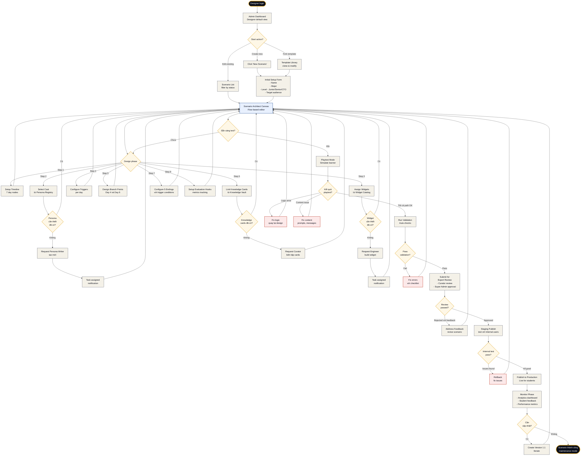
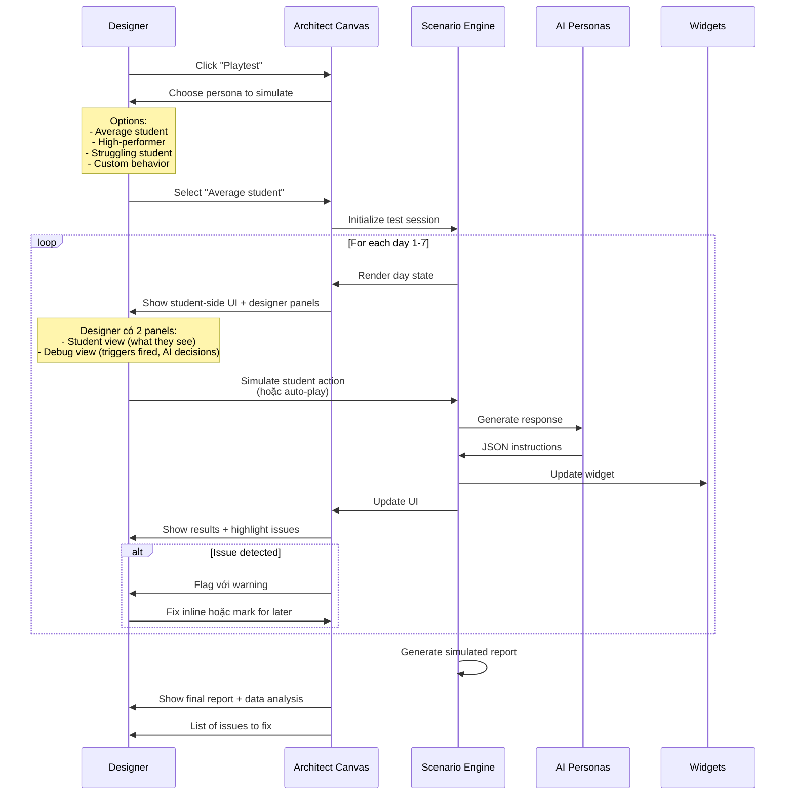

# Flow 04 — Tạo kịch bản mới từ đầu

**Loại flow:** Admin/Designer Journey — Content Creation  
**Actor:** Scenario Designer (có role `designer`)  
**Mục tiêu:** Từ ý tưởng ngành nghề → kịch bản 7 ngày hoàn chỉnh được publish  
**Context:** Đây là flow phức tạp nhất trong admin side — kết hợp Scenario Architect, Persona Studio (read), Widget Studio (read), Knowledge Vault

---

## Main Flow Diagram



---

## Sub-flow: Playtest Mode Detail



---

## Mô tả chi tiết các bước

### Bước 1: Entry — Admin Dashboard

Designer login → thấy dashboard được customize cho role:

**Widgets trên dashboard:**
- **Recent Scenarios** — list scenarios mình đang làm
- **Pending Reviews** — tasks cần feedback từ người khác
- **Analytics Summary** — scenarios đã publish performing thế nào
- **Team Activity** — ai đang làm gì

### Bước 2: Start Action

3 cách bắt đầu:

**Option A: New Scenario from scratch**
- Blank canvas
- Phải setup mọi thứ
- Dùng cho ngành hoàn toàn mới

**Option B: Edit existing**
- Continue scenario đang làm
- Hoặc clone version cũ

**Option C: Fork template**
- LUMINA có template library:
  - "Tech role 7-day template" (base cho SE, Data, DevOps)
  - "Creative role 7-day template" (base cho Design, Marketing)
  - "Professional role 7-day template" (base cho Law, Medicine, Finance)
- Fork → customize cho ngành cụ thể

### Bước 3: Initial Setup Form

**Required fields:**
```yaml
scenario_metadata:
  name: "Kỹ thuật Phần mềm: Junior → Senior"
  major: "Software Engineering"
  level: "Entry-to-Senior Evolution"
  target_audience: ["grade_12", "university_year_1"]
  estimated_time_per_day: "45-60 minutes"
  difficulty_stars: 4
  tags: ["programming", "team_work", "stress_handling"]
```

**Auto-filled fields:**
```yaml
auto_fields:
  id: auto_generated
  author: current_user_id
  created_date: now()
  version: "0.1.0-draft"
  status: "draft"
```

### Bước 4: Scenario Architect Canvas

→ Xem chi tiết: **Scenario Architect (Screen 2)**

**Canvas features:**
- Infinite zoomable canvas (giống Miro/Figma)
- 7 day-nodes arranged horizontally
- Branch points biểu thị bằng diamond shapes
- Connection lines giữa các events
- Sidebar right: Properties panel của node đang chọn

### Bước 5: 8 Design Steps (Iterative, không cần làm tuần tự)

#### Step 1: Timeline Setup

Setup 7 days với metadata cơ bản:

```yaml
for each day 1-7:
  theme: "Cơn say / Bức tường / Khủng hoảng..."
  goal: "Đo lường khả năng gì"
  estimated_time: "45-60 min"
  unlocked_at: "day_n-1 complete + 18h delay"
```

#### Step 2: Cast Selection

Designer kéo personas từ **Persona Registry** vào scenario:

**UI:**
- Sidebar hiện Persona Library với filter:
  - Type: Character / Director / System
  - Specialization: SE / Medical / Law / ...
  - Personality traits

**Drag personas vào scenario:**
- Teacher Alpha → Teacher slot
- Chip → Buddy slot
- Create custom: Boss Nam (new persona specific cho scenario này)

**Missing persona case:**
- Click "Request new persona" → tạo task cho Persona Writer
- Canvas vẫn tiếp tục design được (với placeholder)

#### Step 3: Widget Assignment

Similar flow cho widgets:

**Per day:**
- Assign 1 primary widget + optional secondary widgets
- Config inputs cho widget (initial state, time limits, hidden bugs...)

**Example config:**
```yaml
day_3:
  primary_widget: "log_hunter_v1"
  widget_config:
    log_severity: "critical"
    error_patterns: ["OutOfMemoryException", "Database timeout"]
    time_pressure: true
    countdown_minutes: 15
```

**Missing widget case:**
- Click "Request new widget" → tạo task cho Widget Engineer
- Design tiếp với mock widget (placeholder visual)

#### Step 4: Trigger Configuration

Đây là phần "logic game" của scenario:

**Trigger types:**
- **Time-based**: "After 5 minutes of inactivity"
- **Event-based**: "When widget emits `on_code_change` with errors"
- **State-based**: "When stress_level > 85%"
- **Counter-based**: "After 3 wrong attempts"

**Trigger actions:**
- AI Persona speaks (which one + tone)
- Widget command (inject error, highlight, show hint)
- UI effect (glitch, vignette, sound)
- State change (stress level, buddy mood)

**Visual editor:**
- Kéo "Trigger" block vào day node
- Connect với "Action" blocks
- Specify conditions in form

#### Step 5: Branch Points Design

**Day 4 — Technical Choice:**
```yaml
branch_point_1:
  trigger: "end_of_day_3"
  prompt: |
    "Bạn muốn chuyên sâu về mảng nào?"
  options:
    - id: "frontend_path"
      label: "Frontend/Mobile"
      affects_days: [4, 5, 6]
      changes:
        day_4_widget: "design_forge_v1"
        day_5_widget: "user_feedback_simulator_v1"
    - id: "backend_path"
      label: "Backend/Data"
      affects_days: [4, 5, 6]
      changes:
        day_4_widget: "database_architect_v1"
        day_5_widget: "api_load_tester_v1"
```

**Day 6 — Values Choice:**
```yaml
branch_point_2:
  trigger: "day_6_morning"
  prompt: |
    "Sếp bảo bỏ qua lỗi bảo mật để launch đúng hạn. Bạn?"
  options:
    - id: "ethics_first"
      affects_ending: true
      weight_ethical: +2
    - id: "deadline_first"
      affects_ending: true
      weight_ethical: -1
```

#### Step 6: Knowledge Cards Linking

Link knowledge cards từ **Knowledge Vault (Screen 15)**:

**Per day:**
- Unlock card at day start hoặc at specific trigger
- Card content đã được Curator biên tập trước

**Example:**
```yaml
day_2:
  knowledge_card_unlock: "big_o_notation"
  unlock_trigger: "day_2_start"
  reinforce_on_day: 3  # Day 3 kiểm tra application của card này
```

**Missing cards:**
- Click "Request curator" → task cho Curator biên tập
- Card placeholder với outline content

#### Step 7: Endings Configuration

5 endings với trigger conditions:

```yaml
endings:
  - id: "the_natural"
    conditions:
      - stress_avg: "< 40"
      - performance_score: "> 80"
    title: "The Natural"
    message_template: |
      "Bạn sinh ra để làm ngành này..."
    narrative_tone: "confident_celebratory"
    
  # ... 4 endings khác
```

**Visual ending editor:**
- Preview ending scene với actual data của playtest
- Chỉnh narrative text inline
- Select visual theme (colors, animations)

#### Step 8: Evaluation Hooks Setup

Designer chọn những "cảm biến" để đo lường:

```yaml
evaluation_hooks:
  behavioral_metrics:
    - metric: "stress_tolerance"
      weight: 0.25
      capture: ["max_stress_sustained", "recovery_rate"]
      
    - metric: "persistence"
      weight: 0.20
      capture: ["attempts_before_help", "retry_count"]
      
  decision_tracking:
    - points: ["day_4_technical", "day_6_ethics"]
      capture: ["time_to_decide", "option_hover"]
```

### Bước 6: Playtest Mode

Đây là bước **cực kỳ quan trọng** — catch bugs trước khi publish.

**Simulation personas:**
- **Average Student**: Decisions middle-of-road, moderate stress
- **High Performer**: Correct answers fast, low stress
- **Struggling Student**: Wrong answers often, high stress
- **Erratic Student**: Random behavior, tests edge cases

**Playtest UI:**
- Split screen:
  - Left: Student view (exactly what learner sees)
  - Right: Designer debug panel
    - Current triggers state
    - AI decisions log
    - Variable values
    - Upcoming events

**Speed controls:**
- 1x (real-time)
- 10x (fast playback)
- Step-by-step (pause each interaction)

**Auto-detect issues:**
- Dead-end paths (học sinh không thể thoát)
- Triggers không bao giờ fire
- Endings không reachable
- Contradictory AI responses
- Missing knowledge card references

### Bước 7: Validation (Auto-checks)

Engine chạy static analysis:

```yaml
validation_checks:
  structural:
    - all_days_have_content: required
    - 2_branch_points_defined: required
    - 5_endings_reachable: required
    - cast_complete: required (teacher + buddy min)
    
  content:
    - no_missing_personas: required
    - no_missing_widgets: required
    - no_orphan_knowledge_cards: warning
    
  balance:
    - stress_curve_reasonable: warning
    - performance_attainable: warning
    - time_estimates_realistic: warning
    
  metadata:
    - all_required_fields: required
    - tags_valid: required
    - version_bumped: required
```

**Results UI:**
- Red errors (must fix): blocks publish
- Yellow warnings (should consider): can override with reason
- Green checks: passed

### Bước 8: Expert Review

Designer submit for review → notification tới:
- **Curator** (review knowledge content accuracy)
- **Super Admin** (final approval)

**Review UI:**
- Inline comments on canvas (giống Google Docs)
- Ratings per dimension:
  - Content accuracy (1-5)
  - Educational value (1-5)
  - Pressure authenticity (1-5)
  - Overall quality (1-5)
- Overall: Approve / Request Changes / Reject

**Timeline:**
- Target: Review within 3 business days
- Designer notified via email + in-app

### Bước 9: Staging Publish

Approved scenario → deploy to staging environment:

**Staging testing:**
- 10-20 internal users (LUMINA team)
- Test full 7-day journey
- Feedback form mandatory
- Analytics captured

**Criteria to promote to production:**
- Completion rate > 80% (internal)
- No critical bugs
- Performance metrics acceptable (AI cost, response time)
- Final sign-off by Super Admin

### Bước 10: Production Publish

**Publish actions:**
- Scenario status: `staging` → `production`
- Version: `0.9.0-staging` → `1.0.0`
- Visible in Gateway for all users
- Initial rollout: 10% traffic → 50% → 100% (canary deployment)

**Monitoring after launch:**
- Real-time dashboard: active users, completion rate, issues
- Alert system: stress anomalies, crash reports
- A/B testing framework: test variations

### Bước 11: Iteration & Versioning

Based on learnings:

**Version bump types:**
- **Patch (1.0.1)**: Typo, small content fix
- **Minor (1.1.0)**: New knowledge card, tweaked trigger
- **Major (2.0.0)**: New branch point, restructured timeline

**Migration handling:**
- Students đang trải nghiệm v1.0 không bị affected
- New students bắt đầu với v1.1
- Old version archived sau 6 tháng

---

## Edge Cases & Alternative Paths

### Case 1: Designer bỏ giữa chừng, quay lại sau 2 tuần
**Auto-save system:**
- Save every 30 seconds as draft
- Version control: unlimited drafts
- Resume exactly where left off

### Case 2: Nhiều designers cùng edit 1 scenario
**Collaboration model:**
- V1: Lock system (một người edit, người khác read-only)
- V2+: Real-time collaboration (Figma-like)

**Conflict resolution:**
- Last-write-wins với warning
- Version history accessible

### Case 3: Dependencies conflict
**Scenario:** Designer dùng widget `code_space_v2`, nhưng Engineer release `v3` có breaking changes.

**Handling:**
- Pin widget version trong scenario
- Notification khi new version available
- Manual migration path với changelog

### Case 4: Content cần cập nhật (ví dụ: law changes)
**Flow:**
- Curator flag scenarios chứa outdated knowledge
- Designer nhận notification
- Create new version với updated content
- Deprecate old version after migration period

### Case 5: Scenario fail trong production (bugs, crashes)
**Emergency rollback:**
- Super Admin có quyền emergency rollback
- Rollback to last known good version trong < 5 phút
- Post-mortem analysis required

---

## Screens liên quan

| Screen | Vai trò trong flow |
|:--|:--|
| **Scenario Architect (Screen 2)** | Canvas chính để design |
| **Persona Studio (Screen 3)** | Browse và select personas |
| **Widget Studio (Screen 4)** | Browse widgets (read-only) |
| **Widget Catalog (Screen 14)** | Alternative widget browser |
| **Knowledge Vault (Screen 15)** | Link knowledge cards |
| **Orchestrator Console (Screen 13)** | Configure AI priority |
| **Analytics Dashboard (Screen 16)** | Monitor after publish |

---

## Permission Requirements

**Required permissions:**
- `scenario.create` — để start new scenario
- `scenario.edit` — để modify
- `scenario.publish` — để go live (thường chỉ Super Admin)
- `persona.read` — để browse personas
- `widget.read` — để browse widgets
- `knowledge.read` — để link cards
- `analytics.view` — để monitor

**Role hierarchy:**
- Designer: Create + Edit, NOT publish
- Super Admin: All permissions

---

## Time Estimates

| Phase | Thời gian |
|:--|:--|
| **Initial setup** | 30 phút |
| **Timeline design** | 2-4 giờ |
| **Personas + Widgets selection** | 1-2 giờ |
| **Triggers configuration** | 4-8 giờ (most complex) |
| **Branch points design** | 2-3 giờ |
| **Knowledge cards linking** | 1-2 giờ |
| **Endings + Evaluation** | 2-3 giờ |
| **Playtest iterations** | 8-16 giờ |
| **Review + Fix** | Variable (depends on feedback) |
| **Staging testing** | 1 week |
| **Total for complete scenario** | **~40-80 hours** |

---

## Tóm tắt

| Khía cạnh | Chi tiết |
|:--|:--|
| **Complexity** | Rất cao — flow phức tạp nhất trong admin side |
| **Personas involved** | Designer + Persona Writer + Engineer + Curator + Super Admin |
| **Time to complete** | 40-80 giờ cho 1 kịch bản hoàn chỉnh |
| **Critical checkpoints** | Playtest + Expert Review + Staging |
| **Rollback capability** | Versioned, emergency rollback available |
| **Flow nào phụ thuộc** | Flow 05 (Create Persona), Flow 06 (Create Widget) nếu missing assets |
