# Flow 06 — Tạo Widget mới

**Loại flow:** Admin/Engineer Journey — Tool Development  
**Actor:** Widget Engineer (có role `engineer`)  
**Mục tiêu:** Từ yêu cầu tool mô phỏng → widget hoàn chỉnh ready for deployment  
**Context:** Widgets là "hộp đen công cụ" mô phỏng các tool thực tế của ngành

---

## Main Flow Diagram

```mermaid
flowchart TD
    Enter([Engineer login]) --> Dashboard[Widget Studio Dashboard]
    
    Dashboard --> StartAction{Start?}
    StartAction -->|New widget| RequestSource{Source of<br/>requirement?}
    StartAction -->|Edit existing| EditList[Widget List]
    StartAction -->|Fork template| TemplateLib[Template Library]
    
    RequestSource -->|Designer request| ReviewRequest[Review Designer's request<br/>- What tool to simulate<br/>- What superpower<br/>- Use case examples]
    RequestSource -->|Self-initiated| BrainstormSpec[Brainstorm spec<br/>Research actual tool]
    
    ReviewRequest --> SpecDraft[Draft Widget Spec]
    BrainstormSpec --> SpecDraft
    TemplateLib --> SpecDraft
    EditList --> BuildPhase
    
    SpecDraft --> ManifestDesign[Design Manifest<br/>- inputs<br/>- events<br/>- actions<br/>- fidelity levels]
    
    ManifestDesign --> ValidateSpec{Spec<br/>validated?}
    ValidateSpec -->|Designer feedback needed| DesignerReview[Show to Designer<br/>for feedback]
    DesignerReview --> ManifestDesign
    ValidateSpec -->|OK| BuildPhase[Build Phase]
    
    BuildPhase --> DevChoice{Build approach?}
    DevChoice -->|Visual Builder - low complexity| VisualBuilder[Widget Canvas Builder<br/>Drag-and-drop]
    DevChoice -->|Code Editor - high complexity| CodeEditor[Code Editor<br/>React + custom logic]
    DevChoice -->|Hybrid| HybridDev[Visual + Code]
    
    VisualBuilder --> ComponentAssembly[Assemble Components<br/>- Panels<br/>- Buttons<br/>- Inputs<br/>- Charts]
    CodeEditor --> CustomLogic[Write custom logic<br/>- React components<br/>- State management<br/>- Interaction handlers]
    HybridDev --> ComponentAssembly
    
    ComponentAssembly --> WireUp[Wire up events & actions<br/>theo Manifest contract]
    CustomLogic --> WireUp
    
    WireUp --> FidelityLevels[Configure Fidelity Levels<br/>- Beginner<br/>- Intermediate<br/>- Advanced]
    
    FidelityLevels --> MockDataSetup[Setup Mock Data<br/>for testing]
    
    MockDataSetup --> TestPhase[Testing Phase]
    
    TestPhase --> TestMethod{Test method?}
    TestMethod -->|Unit tests| UnitTest[Unit Test Components<br/>Jest/Vitest]
    TestMethod -->|Integration| IntegrationTest[Integration với mock scenario]
    TestMethod -->|Visual| VisualTest[Storybook-style visual test<br/>all states]
    TestMethod -->|Performance| PerfTest[Performance test<br/>- Render time<br/>- Memory<br/>- FPS]
    TestMethod -->|Accessibility| A11yTest[Accessibility audit<br/>WCAG 2.1 AA]
    
    UnitTest --> TestResult{All tests<br/>pass?}
    IntegrationTest --> TestResult
    VisualTest --> TestResult
    PerfTest --> TestResult
    A11yTest --> TestResult
    
    TestResult -->|Fail| FixIssues[Fix issues]
    TestResult -->|Pass| IntegrationWithScenario[Test với real scenario<br/>Designer collaboration]
    
    FixIssues --> TestPhase
    
    IntegrationWithScenario --> IntegrationOk{Works với<br/>scenario?}
    IntegrationOk -->|Need tweaks| TweakWidget[Adjust based on<br/>scenario needs]
    IntegrationOk -->|OK| CodeReview[Code Review<br/>by senior engineer]
    TweakWidget --> BuildPhase
    
    CodeReview --> ReviewResult{Review<br/>approved?}
    ReviewResult -->|Changes needed| AddressReview[Address comments]
    ReviewResult -->|Approved| DeployStaging[Deploy to Staging]
    AddressReview --> BuildPhase
    
    DeployStaging --> StagingTest[Staging validation<br/>- Test với real scenarios<br/>- Team QA]
    
    StagingTest --> StagingOk{Staging<br/>OK?}
    StagingOk -->|Issues| RollbackStaging[Rollback + Fix]
    StagingOk -->|Pass| ProductionDeploy[Deploy to Production<br/>với feature flag]
    RollbackStaging --> BuildPhase
    
    ProductionDeploy --> GradualRollout[Gradual Rollout<br/>10% → 50% → 100%]
    
    GradualRollout --> Monitor[Monitor Production<br/>- Error rates<br/>- Performance<br/>- User behavior]
    
    Monitor --> ProductionOk{Metrics<br/>healthy?}
    ProductionOk -->|Issues| EmergencyFix[Emergency fix<br/>or rollback]
    ProductionOk -->|Good| FullAvailability[Full availability<br/>Widget in Catalog]
    EmergencyFix --> BuildPhase
    
    FullAvailability --> VersionMaintenance[Version Maintenance<br/>- Bug fixes<br/>- Feature updates<br/>- Dependencies]
    
    VersionMaintenance --> NewVersion{New version<br/>needed?}
    NewVersion -->|Yes| BuildPhase
    NewVersion -->|No| End([Widget stable<br/>in production])
    
    classDef startEnd fill:#0A0E1A,stroke:#DFA319,stroke-width:2px,color:#FBFAF6
    classDef decision fill:#FEF7E6,stroke:#DFA319,stroke-width:2px,color:#0A0E1A
    classDef process fill:#F4F1E8,stroke:#2A3045,stroke-width:1px,color:#0A0E1A
    classDef build fill:#E8F0FE,stroke:#4A6FA5,stroke-width:2px,color:#0A0E1A
    classDef test fill:#FEF7E6,stroke:#DFA319,stroke-width:2px,color:#0A0E1A
    classDef danger fill:#FCE9E9,stroke:#C9584A,stroke-width:1px,color:#0A0E1A
    
    class Enter,End startEnd
    class StartAction,RequestSource,ValidateSpec,DevChoice,TestMethod,TestResult,IntegrationOk,ReviewResult,StagingOk,ProductionOk,NewVersion decision
    class Dashboard,EditList,TemplateLib,ReviewRequest,BrainstormSpec,SpecDraft,ManifestDesign,DesignerReview,ComponentAssembly,CustomLogic,WireUp,FidelityLevels,MockDataSetup,IntegrationWithScenario,CodeReview,AddressReview,DeployStaging,StagingTest,ProductionDeploy,GradualRollout,Monitor,FullAvailability,VersionMaintenance process
    class BuildPhase,VisualBuilder,CodeEditor,HybridDev build
    class TestPhase,UnitTest,IntegrationTest,VisualTest,PerfTest,A11yTest test
    class FixIssues,TweakWidget,RollbackStaging,EmergencyFix danger
```



---

## Mô tả chi tiết các bước

### Bước 1: Entry — Widget Studio Dashboard

→ Xem chi tiết: **Widget Studio (Screen 4)**

**Dashboard widgets:**
- **My Widgets** — widgets đang develop
- **Pending Requests** — requests từ Designers
- **Template Library** — starters cho common widgets
- **Integration Status** — widgets đang được dùng scenarios
- **Performance Monitoring** — widgets có issues

### Bước 2: Request Source

**3 nguồn thường gặp:**

**Option A: Designer request**
- Từ Flow 04 (Create Scenario), Designer request widget
- Ticket có:
  - Tool cần mô phỏng (VD: "Postman-like API tester")
  - Superpower cần (VD: "Send request + read response")
  - Use case (VD: "Day 5 Marketing - test email API")
  - Fidelity level (basic/intermediate/advanced)

**Option B: Self-initiated**
- Engineer nhận thấy ngành mới cần widgets
- Research tool thực tế
- Proactively build library

**Option C: Fork template**
- LUMINA có widget templates:
  - Code-editor template (base cho CodeSpace, SQLEditor, etc.)
  - Dashboard template (base cho analytics widgets)
  - Form template (base cho data entry widgets)
- Fork → customize

### Bước 3: Spec Draft

**Spec Document (markdown):**
```markdown
# Widget Spec: CodeSpace v2

## Overview
- **Inspired by**: VS Code
- **Superpower**: Code editing với live feedback
- **Target scenarios**: Software Engineering, Data Science

## User Stories
- As a student, I can edit code với syntax highlighting
- As a student, I can run code và see output
- As scenario engine, I can inject errors to test student's reaction

## Fidelity Levels
- Beginner: Simple editor + run button
- Intermediate: + File tree, terminal
- Advanced: + Extensions, debug panel

## Technical Requirements
- Monaco Editor integration
- Sandboxed code execution
- Response time < 100ms

## Out of Scope
- Git integration (future)
- Collaborative editing (future)
```

### Bước 4: Manifest Design

→ Xem template đầy đủ trong **file 04-Kien-truc-Widget.md**

**Key decisions:**

**Inputs (what scenario provides):**
```yaml
inputs:
  - name: "initial_code"
    type: "string"
    required: true
    
  - name: "language"
    type: "enum[javascript, python, typescript, java]"
    required: true
    
  - name: "hidden_bugs"
    type: "array"
    required: false
    
  # ... more
```

**Events (what widget emits):**
```yaml
events:
  - name: "on_code_change"
    payload: { new_code, lines_changed, timestamp }
    
  - name: "on_run"
    payload: { output, errors, duration_ms, success }
    
  # ... more
```

**Actions (what scenario can command):**
```yaml
actions:
  - name: "highlight_line"
    parameters: { line_number, color, duration }
    
  - name: "inject_error"
    parameters: { line_number, message, severity }
    
  # ... more
```

**Manifest validation:**
- All required fields filled
- Types valid
- Dependencies declared
- Backwards compatible (nếu update version)

### Bước 5: Designer Review on Spec

Before implementation, show spec cho Designer:
- "Does this match your needs?"
- "Missing anything?"
- "Change priorities?"

**Iteration cycle:**
- 1-2 rounds of feedback
- Get sign-off trước khi code

### Bước 6: Build Phase

3 approaches tùy complexity:

#### Approach A: Visual Builder (Low complexity widgets)

**Widget Canvas Builder:**
- Drag atomic elements:
  - Button, Input, Label
  - Panel, Divider, Card
  - Chart (bar, line, pie)
  - Table, List
  - Modal, Tooltip
- Configure properties
- Connect events

**Output:** Auto-generated React component code

**Suitable for:**
- Simple forms
- Basic dashboards
- Static visualizations

#### Approach B: Code Editor (High complexity widgets)

**In-browser IDE:**
- Full React component code
- Access to widget helper libraries
- Hot reload for testing

**Libraries available:**
- LUMINA Design System components
- Monaco Editor (for code-editing widgets)
- Recharts (for data viz)
- React DnD (for drag-drop)
- Zustand (for state management)

**Suitable for:**
- Complex tools (CodeSpace, DeployFlow)
- Custom visualizations
- Real-time simulations

#### Approach C: Hybrid

**Visual for layout + Code for logic:**
- Use Visual Builder cho structure
- Drop down into code for custom behaviors
- Best of both worlds

### Bước 7: 4 Widget Layers Implementation

#### Layer 1: Visual Shell
```jsx
// CodeSpaceVisual.jsx
export const CodeSpaceVisual = ({ config, state, onEvent }) => {
  return (
    <div className="code-space-container">
      {config.fidelity_level !== 'beginner' && (
        <FileTree files={state.files} />
      )}
      
      <CodeEditor
        code={state.code}
        language={config.language}
        readOnlyLines={config.read_only_lines}
        highlights={state.highlights}
        onChange={(newCode) => onEvent('on_code_change', { newCode })}
      />
      
      {config.fidelity_level !== 'beginner' && (
        <Terminal output={state.output} />
      )}
      
      {state.errors.length > 0 && <ErrorPanel errors={state.errors} />}
    </div>
  );
};
```

#### Layer 2: Interaction Layer
```javascript
// CodeSpaceInteractions.js
export const handleCodeChange = (newCode, config, emit) => {
  const detectedBugs = checkForBugs(newCode, config.hidden_bugs);
  
  emit('on_code_change', {
    new_code: newCode,
    lines_changed: getChangedLines(prev.code, newCode),
    timestamp: new Date().toISOString()
  });
  
  return { code: newCode, detectedBugs };
};
```

#### Layer 3: State Management
```javascript
// useWidgetState.js
export const useWidgetState = (config) => {
  const [state, setState] = useState({
    code: config.initial_code,
    errors: [],
    highlights: [],
    isRunning: false
  });
  
  const handleAction = useCallback((actionName, params) => {
    switch(actionName) {
      case 'highlight_line':
        setState(prev => ({
          ...prev,
          highlights: [...prev.highlights, params]
        }));
        break;
      // ... more actions
    }
  }, []);
  
  return { state, handleAction };
};
```

#### Layer 4: Scenario Bridge
```javascript
// WidgetBridge.js
export class CodeSpaceBridge extends WidgetBridge {
  constructor(scenarioEngine) {
    super('code_space_v2', scenarioEngine);
    this.setupEventHandlers();
  }
  
  setupEventHandlers() {
    this.registerEventHandler('on_code_change', (payload) => {
      this.engine.processWidgetEvent(this.widgetId, 'on_code_change', payload);
    });
    // ... more handlers
  }
}
```

### Bước 8: Fidelity Levels Configuration

Configure per-level features:

```yaml
fidelity_levels:
  beginner:
    visible_elements:
      - main_editor
      - run_button
      - simple_output
    hidden_elements:
      - file_tree
      - terminal
      - debug_panel
      - extensions
      
  intermediate:
    visible_elements:
      - main_editor
      - run_button
      - output
      - file_tree
      - terminal
      - debug_panel
    features_enabled:
      - keyboard_shortcuts
      - multiple_tabs
      
  advanced:
    all_features_enabled: true
    additional_elements:
      - extensions_panel
      - git_status
      - problem_tab
```

**Purpose:** Same widget, different complexity based on student's day.

### Bước 9: Mock Data Setup

Để test widget, cần mock data:

```javascript
// mockData.js
export const codeSpaceMocks = {
  basic: {
    initial_code: "// Hello world",
    language: "javascript",
    hidden_bugs: [],
    time_limit: null,
    fidelity_level: "beginner"
  },
  
  crisis: {
    initial_code: crisisServerCode,  // buggy code
    language: "javascript",
    hidden_bugs: [
      { line_number: 23, error_type: "null_reference", severity: "error" },
      { line_number: 45, error_type: "memory_leak", severity: "warning" },
      { line_number: 67, error_type: "infinite_loop", severity: "critical" }
    ],
    time_limit: 300,
    fidelity_level: "intermediate"
  },
  
  // ... more mocks cho different scenarios
};
```

### Bước 10: Testing Phase

**5 test types:**

#### Test 1: Unit Tests
- Test individual functions
- Pure logic testing
- Fast feedback

```javascript
describe('CodeSpace event handlers', () => {
  test('on_code_change emits correct payload', () => {
    const emit = jest.fn();
    handleCodeChange("new code", mockConfig, emit);
    expect(emit).toHaveBeenCalledWith('on_code_change', 
      expect.objectContaining({ new_code: "new code" })
    );
  });
  
  test('inject_error action updates state', () => {
    const { result } = renderHook(() => useWidgetState(mockConfig));
    act(() => {
      result.current.handleAction('inject_error', {
        line_number: 10, message: "Syntax error"
      });
    });
    expect(result.current.state.errors).toHaveLength(1);
  });
});
```

#### Test 2: Integration Tests
- Widget với mock scenario engine
- Full event-action cycle
- Verify contract compliance

#### Test 3: Visual Tests (Storybook-style)
- All states rendered
- Different fidelity levels
- Edge cases (empty, full, error)

#### Test 4: Performance Tests
- Render time < 100ms for initial mount
- 60 FPS during interactions
- Memory leaks check
- Bundle size limits

#### Test 5: Accessibility Tests
- Keyboard navigation
- Screen reader compatibility
- Color contrast (WCAG AA)
- Focus management

### Bước 11: Integration with Real Scenario

**Test với Designer:**
- Deploy widget to internal staging
- Designer integrates vào scenario đang build
- Real-world feedback
- Iterate based on findings

### Bước 12: Code Review

**Reviewer checklist:**
- Code quality (DRY, SOLID)
- Manifest compliance
- Error handling
- Performance considerations
- Security (no XSS, no arbitrary code execution without sandbox)
- Documentation
- Tests coverage > 80%

### Bước 13: Deploy Phases

**Staging deploy:**
- Widget available in Widget Catalog (with "Staging" tag)
- Can be used in test scenarios
- Not visible to end users

**Production deploy with feature flag:**
- Gradual rollout:
  - 10% scenarios using it
  - Monitor metrics
  - 50% → 100%

**Monitoring:**
- Error rates
- Response times
- User behavior (are they actually using features?)
- Cost impact (some widgets trigger more AI calls)

### Bước 14: Full Availability

Widget available in Widget Catalog cho Designers sử dụng.

**Metadata in Catalog:**
- Preview image/video
- Fidelity levels
- Dependencies
- Used by N scenarios
- Rating từ Designers

### Bước 15: Maintenance & Versioning

**Semantic versioning:**
- **Patch (2.1.3 → 2.1.4)**: Bug fixes, no contract change
- **Minor (2.1.x → 2.2.0)**: New features, new optional inputs
- **Major (2.x.x → 3.0.0)**: Breaking changes (reluctant)

**Version pinning:**
- Scenarios pin widget version
- Manual migration khi major update
- Old versions archived after 1 year

---

## Edge Cases & Alternative Paths

### Case 1: Widget có security vulnerability
**Detection:** Security scan, pen testing, user report

**Emergency response:**
- Immediate: Disable widget globally
- Hotfix: Patch + emergency deploy
- Communication: Notify affected scenarios
- Post-mortem

### Case 2: Widget performance regression
**Example:** Update slows rendering by 50%

**Flow:**
- CI/CD catches via perf tests
- Block deploy
- Investigate
- Optimize or rollback change

### Case 3: External API dependency fails
**Example:** Monaco Editor CDN down

**Resilience patterns:**
- Fallback to simpler editor
- Local copy of critical dependencies
- Graceful degradation message

### Case 4: Widget bị hack / cheated bởi student
**Example:** Student finds way to skip bugs

**Detection:**
- Anomaly detection trong behavioral data
- User report from other students

**Fix:**
- Patch the exploit
- Review design for similar weaknesses

### Case 5: Designer request widget không thể build
**Example:** "Tôi muốn widget VR cho y khoa" but V1 không support VR

**Resolution:**
- Escalate to Super Admin
- Propose alternative solutions
- Add to roadmap cho V2-V3
- Document rejection reason

---

## Screens liên quan

| Screen | Vai trò trong flow |
|:--|:--|
| **Widget Studio (Screen 4)** | Main screen cho build |
| **Widget Catalog (Screen 14)** | Browse, xem dependencies |
| **Scenario Architect (Screen 2)** | Designer tests widget trong scenario |
| **Analytics Dashboard (Screen 16)** | Monitor performance |

---

## Permission Requirements

- `widget.create` — start new widget
- `widget.edit` — modify
- `widget.deploy` — deploy to production (thường Super Admin)
- `scenario.read` — xem scenarios đang dùng widget

---

## Time Estimates

| Phase | Thời gian |
|:--|:--|
| **Spec + Manifest design** | 4-8 giờ |
| **Visual implementation** | 8-16 giờ (depending on complexity) |
| **Logic + State** | 8-24 giờ |
| **Testing (all 5 types)** | 16-24 giờ |
| **Integration với Scenario** | 4-8 giờ |
| **Code Review + Fixes** | Variable |
| **Total per widget** | **~40-80 giờ** |

*Note: Templates có thể reduce time by 50%*

---

## Tóm tắt

| Khía cạnh | Chi tiết |
|:--|:--|
| **Complexity** | Rất cao — đòi hỏi software engineering skills |
| **Who can do** | Widget Engineer + Super Admin |
| **Time to complete** | 40-80 giờ cho 1 widget hoàn chỉnh |
| **Critical bước** | Manifest design (cho tái sử dụng) + Testing |
| **Reusability** | Cross-scenario qua Widget Registry |
| **Security** | Sandboxing required cho user-generated widgets (V3) |
