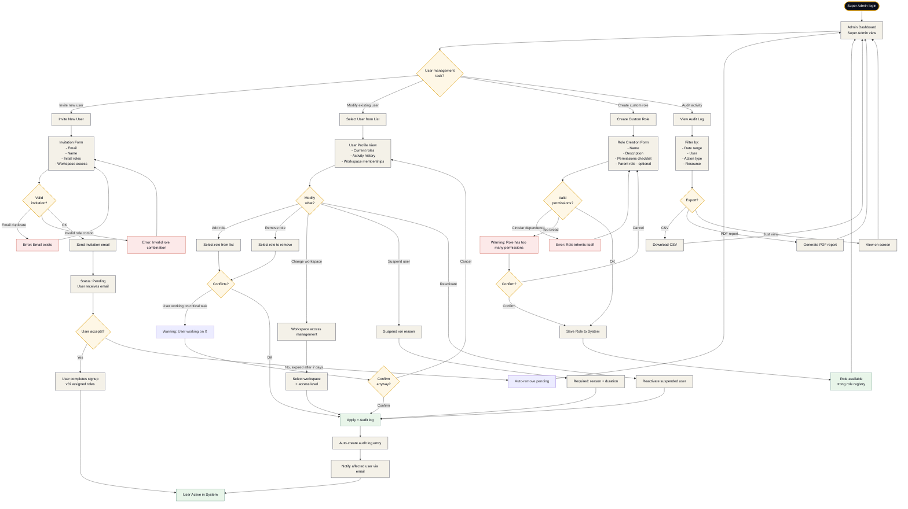
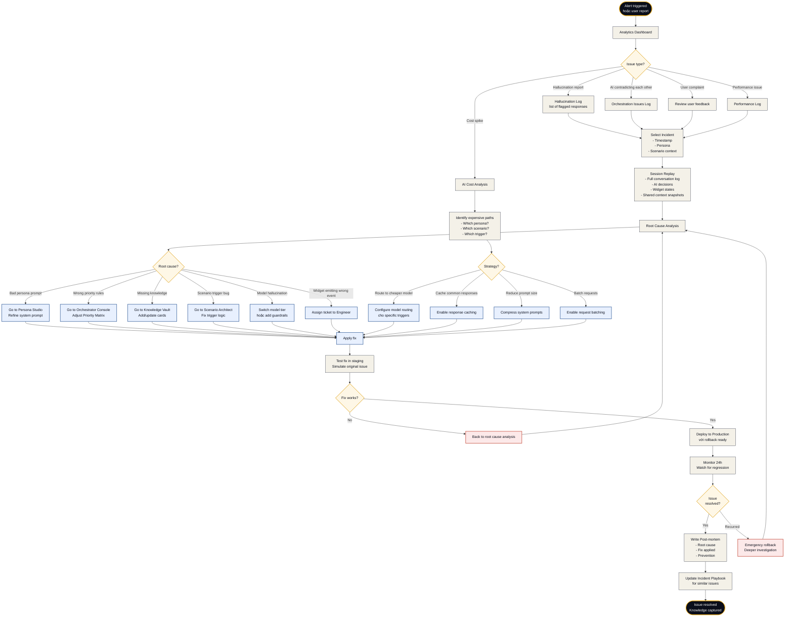

# Flow 07 — System Management

**Loại flow:** System Administration — Role Management + Orchestration Debug  
**Actor:** Super Admin (có role `super_admin`)  
**Mục tiêu:** Quản lý users + roles và debug khi AI orchestration gặp vấn đề  
**Context:** Đây là flow của người vận hành hệ thống, kết hợp 2 scenarios thường gặp

*Note: Flow này gộp 2 sub-flows vì chúng đều là system administration tasks và thường do cùng Super Admin thực hiện.*

---

## Sub-flow A: User & Role Assignment

### Diagram



---

## Sub-flow B: Orchestration Debug

### Diagram



---

## Sub-flow A: User & Role Assignment Chi tiết

### Scenario A1: Invite New User

**Use case:** Hire một designer mới, cần set up account

**Steps:**

1. **Access User Management (Screen 17)**
   - Click "Invite User" button
   - Form pops up

2. **Fill invitation details**
   ```yaml
   invitation_form:
     email: "carol@lumina.com"
     full_name: "Carol Nguyen"
     title: "Senior Scenario Designer"  # optional
     
     initial_roles:
       - "designer"  # primary role
       - "curator"   # secondary - can also review knowledge
     
     workspace_access:
       - workspace_id: "lumina_official"
         access_level: "member"
     
     expires_at: "+7 days"  # invitation expiry
     
     personal_message: |
       "Welcome to LUMINA! Looking forward to working with you on the SE scenario."
   ```

3. **Validation**
   - Email uniqueness check
   - Role combination valid (không conflict)
   - Workspace exists và active

4. **Send invitation**
   - Email có:
     - Personalized message
     - Magic link để setup account (không password)
     - Overview of roles assigned
     - Expected first tasks
   - Status: `pending`

5. **User accepts invitation**
   - Click magic link → setup password
   - 2FA setup (mandatory for all internal users)
   - Complete profile: avatar, bio, skills
   - Tutorial: giới thiệu tools có access

6. **User becomes active**
   - Notification to Super Admin
   - Auto-assigned to relevant Slack/Discord channels
   - Welcome meeting scheduled

### Scenario A2: Modify Existing User Roles

**Use case:** Promote existing designer to persona_writer role

**Steps:**

1. **Find user in list** (Screen 17)
   - Search by name/email
   - Filter by role/status/workspace

2. **User Profile Page**
   Hiển thị:
   - Current roles với add/remove buttons
   - Activity history (last 30 days)
   - Current tasks (nếu có)
   - Workspace memberships
   - 2FA status, last login

3. **Add role action**
   - Click "Add Role" → dropdown
   - Select "persona_writer"
   - System check conflicts:
     - Có conflict với existing roles không?
     - User có đang làm critical task không?

4. **Validation warnings (nếu có)**
   - Example: "Carol đang edit scenario SE-v2 (50% complete). Adding role `persona_writer` không ảnh hưởng scenario, nhưng sẽ tăng workload. Continue?"

5. **Confirm & Apply**
   - Role applied immediately
   - User permissions refresh trong < 1 phút
   - Audit log entry created

6. **Notify user**
   - Email: "You've been granted new role: persona_writer"
   - In-app notification
   - Link to new tools/screens available

### Scenario A3: Create Custom Role

**Use case:** Cần role mới cho "Junior Designer" với quyền hạn chế hơn `designer`

**Steps:**

1. **Role Creation Form**
   ```yaml
   new_role:
     name: "junior_designer"
     display_name: "Junior Scenario Designer"
     description: "Can design scenarios but cannot publish"
     
     permissions:
       - scenario.create
       - scenario.edit
       # NOT scenario.publish
       # NOT scenario.delete
       - persona.read
       - widget.read
       - knowledge.read
       - analytics.view
     
     parent_role: null  # không inherit
     # Alternative: parent_role: "designer" + exclude ["scenario.publish", "scenario.delete"]
   ```

2. **Validation**
   - Role name uniqueness
   - Permissions exist
   - No circular dependency
   - Makes sense (VD: không thể create scenario mà không đọc được personas)

3. **Warnings nếu cần**
   - "Role này rất broad, xem xét divide thành 2 roles"
   - "Role này thiếu permissions thông thường cho designer work"

4. **Save Role**
   - Available trong role registry
   - Có thể assign cho users

### Scenario A4: Audit Activity

**Use case:** Investigate suspicious activity hoặc regular compliance check

**Filter options:**
- Date range
- User (specific hoặc all)
- Action type (create, edit, delete, publish, login...)
- Resource (scenario, persona, widget...)
- Workspace

**Log entry format:**
```yaml
audit_log_entry:
  timestamp: "2026-04-23T14:23:45Z"
  user_id: "user_carol_123"
  user_name: "Carol Nguyen"
  action: "scenario.publish"
  resource_type: "scenario"
  resource_id: "se-junior-to-senior-v1.2"
  resource_name: "Kỹ thuật Phần mềm: Từ Junior đến Senior"
  workspace: "lumina_official"
  
  metadata:
    from_status: "staging"
    to_status: "production"
    version: "1.2.0"
    
  ip_address: "xxx.xxx.xxx.xxx"
  user_agent: "Mozilla/5.0..."
  
  outcome: "success"
```

**Export options:**
- CSV (cho spreadsheet analysis)
- PDF report (cho formal compliance)
- JSON (cho external tools)

---

## Sub-flow B: Orchestration Debug Chi tiết

### Scenario B1: Hallucination Investigation

**Trigger:** Alert system flags response OR student reports incorrect info

**Steps:**

1. **Access Analytics Dashboard** (Screen 16)
   - Hallucination Log shows flagged responses
   - Severity levels: Critical / High / Medium / Low

2. **Select Incident**
   Entry shows:
   ```yaml
   incident:
     timestamp: "2026-04-22T10:15:30Z"
     persona: "teacher_alpha"
     scenario: "se-junior-to-senior-v1.2"
     day: 3
     
     trigger: "student_question_about_algorithm"
     student_message: "Hàm sort này có O(n log n) không?"
     ai_response: "Đúng rồi, bubble sort là O(n log n)."
     
     flagged_by: "guardrail_ai"
     flag_reason: "contradicts_knowledge_card_sorting_algorithms"
     expected: "bubble sort is O(n²)"
     
     severity: "high"
     impact: "student learned incorrect fact"
     affected_users: 1
   ```

3. **Session Replay**
   Xem full context:
   - Messages trước/sau
   - Widget states tại thời điểm đó
   - Shared context snapshot
   - AI decision log (why did Alpha say this?)

4. **Root Cause Analysis**
   Possible causes:
   - ❌ Alpha's system prompt không đủ strict về accuracy
   - ❌ Knowledge card "sorting_algorithms" không được reference đúng
   - ❌ Model hallucinated despite guardrails
   - ❌ Guardrail AI missed this instance earlier

5. **Apply Fix**
   Path A - If prompt issue:
   - Go to Persona Studio
   - Add strict rule: "MUST cite knowledge card for any Big O notation claim"
   - Test with regression suite
   
   Path B - If knowledge missing:
   - Go to Knowledge Vault
   - Update card "sorting_algorithms" với complete O notations
   - Link to Alpha persona

6. **Test in Staging**
   - Reproduce original question
   - Verify correct response
   - Run 20 similar questions to ensure no regression

7. **Deploy + Monitor**
   - Deploy fix
   - Monitor next 24h
   - Similar hallucinations decrease?

### Scenario B2: AI Contradiction Debug

**Trigger:** Student sees contradictory messages from Alpha and Chip

**Example:**
- Alpha: "You're making progress, continue!"
- Chip (2 seconds later): "Hey take a break, you're struggling"

**Debug steps:**

1. **Orchestration Issues Log** (Screen 13 - Orchestrator Console)
   - Showing contradiction detection

2. **Check Shared Context Board**
   - At time T: Alpha said "encouraging"
   - Chip context: "student stressed" (different read)
   - Both AIs acted on different context

3. **Root cause**
   - Shared context update delay (race condition)
   - Chip read stale data

4. **Fix**
   - Orchestrator Console: adjust priority rules
   - "After Alpha speaks encouragingly, Chip waits 30s before commenting on stress"
   - OR: Force sync context before Chip response

### Scenario B3: Cost Spike Investigation

**Alert:** AI cost jumped 40% this week

**Investigation:**

1. **Cost Analysis Dashboard** shows:
   - Cost by persona
   - Cost by scenario
   - Cost by day of week
   - Cost per student session

2. **Identify culprit:**
   - "Mr. Alpha cost doubled"
   - "Specifically in scenario SE-v1.2"
   - "Day 3 particularly expensive"

3. **Drill down:**
   - Day 3 Mr. Alpha responses averaging 500 tokens (was 200)
   - Why? Prompt now includes full scenario context

4. **Optimize:**
   - Compress system prompt
   - Remove redundant context
   - Test with reduced context
   - Validate quality không giảm

5. **Deploy + Monitor:**
   - Cost returns to baseline
   - Quality metrics stable

### Scenario B4: Scenario Trigger Bug

**Report:** Student stuck on Day 4 — branch choice không xuất hiện

**Investigation:**

1. **Session Replay** shows:
   - Day 3 complete ✅
   - Day 4 start ✅
   - Trigger `show_branch_point_1` expected to fire
   - But didn't

2. **Scenario Architect** inspection:
   - Trigger condition: `end_of_day_3 AND student_progress = 100%`
   - Student's `student_progress` was 99.8% (rounding issue)

3. **Fix:**
   - Change condition: `student_progress >= 95%`
   - Or: Add fallback trigger: `2_minutes_after_day_4_start`

4. **Deploy fix + Monitor**

---

## Incident Response Playbook

**Critical incidents (P0):**
- Persona producing harmful content
- System down
- Data breach

**Response time:** < 15 phút

**Actions:**
- Page on-call engineer
- Emergency rollback authority
- Post-mortem within 48h

**High priority (P1):**
- Hallucination affecting learning quality
- Cost spike > 50%
- Orchestration failures

**Response time:** < 2 hours

**Medium (P2):**
- Individual user issues
- Non-critical bugs

**Response time:** < 1 day

---

## Screens liên quan

### Sub-flow A (User Management):
| Screen | Vai trò |
|:--|:--|
| **User & Workspace Management (Screen 17)** | Main screen |
| **Role & Permission Management (Screen 18)** | Create/edit roles |

### Sub-flow B (Debug):
| Screen | Vai trò |
|:--|:--|
| **Analytics Dashboard (Screen 16)** | Entry point cho issues |
| **Orchestrator Console (Screen 13)** | Fix priority rules |
| **Persona Studio (Screen 3)** | Fix prompt issues |
| **Knowledge Vault (Screen 15)** | Fix knowledge issues |
| **Scenario Architect (Screen 2)** | Fix trigger logic |

---

## Permission Requirements

### Sub-flow A:
- `users.manage` — Modify users
- `users.invite` — Invite new
- `system.config` — Create roles

### Sub-flow B:
- `analytics.view` — View all logs
- Tùy persona/widget/scenario — cần respective edit permissions
- `system.config` — Deploy fixes

**Cần Super Admin cho:** Emergency rollback, role creation

---

## Time Estimates

### User Management:
- **Invite user**: 5 phút/user
- **Modify roles**: 2-5 phút/user
- **Create custom role**: 15-30 phút
- **Audit review**: 30 phút - 2 giờ

### Debug:
- **Simple hallucination fix**: 30-60 phút
- **Complex orchestration bug**: 2-8 giờ
- **Cost optimization**: 4-16 giờ
- **Emergency response**: 15 phút - hours (depending on severity)

---

## Tóm tắt

| Khía cạnh | Sub-flow A | Sub-flow B |
|:--|:--|:--|
| **Who** | Super Admin | Super Admin + Operators |
| **Frequency** | Weekly | Daily monitoring + incident-driven |
| **Complexity** | Medium | Variable (LOW - HIGH) |
| **Criticality** | Medium | Very High (affects production) |
| **Key screens** | 17, 18 | 16, 13, 3, 15, 2 |
| **Recovery time** | N/A | 15 min - hours depending on severity |
