# Flow 08 — Parent Onboarding & Child Linking

**Loại flow:** Parent Journey — Account Creation & Student Linking  
**Actor:** Phụ huynh (role `parent`)  
**Mục tiêu:** Từ nghe về LUMINA → tạo account → link với con → theo dõi tiến độ  
**Context:** Flow mới thêm vào V1 sau khi quyết định thêm Parent Dashboard (Screen 20)

---

## Main Flow Diagram

```mermaid
flowchart TD
    Entry([Phụ huynh biết về LUMINA]) --> EntryPath{Nguồn<br/>entry?}
    
    EntryPath -->|Con kể về LUMINA| ChildInitiated[Child-initiated Flow]
    EntryPath -->|Nhận email từ con| EmailInvite[Email Invitation Flow]
    EntryPath -->|Tự tìm hiểu về LUMINA| SelfSearch[Self-search Flow]
    EntryPath -->|Trường cấp 3 giới thiệu| SchoolReferral[School Referral Flow]
    
    ChildInitiated --> ParentLanding[Parent Landing Page<br/>claude.ai/parents]
    SelfSearch --> ParentLanding
    SchoolReferral --> ParentLanding
    EmailInvite --> InviteAccept[Click link trong email<br/>Pre-filled invitation]
    
    ParentLanding --> ParentSignup[Parent Signup Form<br/>- Email<br/>- Phone - optional<br/>- Full name<br/>- Relationship to child]
    
    InviteAccept --> ParentSignup
    
    ParentSignup --> VerifyIdentity[Verify Email + Phone<br/>2FA mandatory]
    
    VerifyIdentity --> LinkChild{Đã có link<br/>tới con?}
    
    LinkChild -->|Có - từ email invite| ConfirmChild[Confirm Child Connection<br/>Xem info của con]
    LinkChild -->|Chưa - manual link| ManualLink[Manual Child Linking]
    LinkChild -->|Con chưa có account| InviteChild[Invite Child<br/>Parent tạo invitation cho con]
    
    ManualLink --> LinkMethod{Phương thức<br/>link?}
    LinkMethod -->|Search bằng email con| EmailSearch[Nhập email con → gửi request]
    LinkMethod -->|Share code từ con| ShareCode[Nhập 6-digit code từ con]
    LinkMethod -->|QR code| QRScan[Scan QR từ con app]
    
    EmailSearch --> ChildApproval[Con nhận notification<br/>Approve link request]
    ShareCode --> CodeValid{Code<br/>hợp lệ?}
    QRScan --> CodeValid
    
    CodeValid -->|Hết hạn| RegenCode[Yêu cầu con generate code mới]
    CodeValid -->|Invalid| ErrorInvalid[Error: Wrong code]
    CodeValid -->|Valid| ChildApproval
    
    RegenCode --> ShareCode
    ErrorInvalid --> ShareCode
    
    ChildApproval --> ApprovalResult{Con<br/>approve?}
    ApprovalResult -->|Approve| LinkEstablished[Link Established]
    ApprovalResult -->|Reject| LinkRejected[Link Rejected<br/>Parent notified]
    ApprovalResult -->|Timeout 48h| LinkExpired[Request Expired<br/>Parent can retry]
    
    InviteChild --> ChildInviteForm[Child Invitation Form<br/>- Email con<br/>- Tên con<br/>- Tuổi con]
    ChildInviteForm --> AgeCheck{Tuổi con?}
    AgeCheck -->|< 13| COPPAConsent[COPPA Consent<br/>Parent verify legal authority]
    AgeCheck -->|13-16| MinorConsent[Minor Consent<br/>Parent oversight default]
    AgeCheck -->|> 16| StandardInvite[Standard Invite<br/>Child independent]
    
    COPPAConsent --> SendChildInvite[Send invitation to child]
    MinorConsent --> SendChildInvite
    StandardInvite --> SendChildInvite
    
    SendChildInvite --> ChildSignsUp[Con signup<br/>auto-linked]
    ChildSignsUp --> LinkEstablished
    
    ConfirmChild --> LinkEstablished
    
    LinkEstablished --> SetupTransparency[Setup Transparency Level<br/>- Minimal<br/>- Standard<br/>- Full]
    
    SetupTransparency --> TransparencyDecision{Ai quyết định?}
    TransparencyDecision -->|Child < 16| ParentSets[Parent sets default<br/>Child có thể request change]
    TransparencyDecision -->|Child >= 16| ChildSets[Child decides<br/>Parent được notified]
    TransparencyDecision -->|Mutual agreement| Negotiation[In-app negotiation<br/>Both agree]
    
    ParentSets --> ParentDashboard[Parent Dashboard<br/>Home view]
    ChildSets --> ParentDashboard
    Negotiation --> ParentDashboard
    
    ParentDashboard --> DashboardActions{Parent<br/>action?}
    
    DashboardActions -->|Xem tiến độ con| ViewProgress[View Child Progress<br/>Based on transparency level]
    DashboardActions -->|Mua scenario cho con| PurchaseFlow[Purchase Scenario<br/>Gift to child]
    DashboardActions -->|Xem reports| ViewReports[View Completed Reports<br/>If transparency allows]
    DashboardActions -->|Link thêm con khác| BackToLinkChild[Quay lại LinkChild flow]
    DashboardActions -->|Update transparency| RequestTransparencyChange[Request change<br/>Needs child approval if >= 16]
    DashboardActions -->|Settings| ParentSettings[Parent Account Settings]
    
    ViewProgress --> DashboardActions
    PurchaseFlow --> PurchaseSuccess[Payment success<br/>Child notified + scenario unlocked]
    ViewReports --> DashboardActions
    BackToLinkChild --> ManualLink
    RequestTransparencyChange --> ChildNotification[Notify child<br/>Pending approval]
    ParentSettings --> DashboardActions
    
    PurchaseSuccess --> DashboardActions
    ChildNotification --> DashboardActions
    
    LinkRejected --> End1([Parent có thể retry<br/>hoặc liên hệ với con trực tiếp])
    LinkExpired --> End1
    
    classDef startEnd fill:#0A0E1A,stroke:#DFA319,stroke-width:2px,color:#FBFAF6
    classDef decision fill:#FEF7E6,stroke:#DFA319,stroke-width:2px,color:#0A0E1A
    classDef process fill:#F4F1E8,stroke:#2A3045,stroke-width:1px,color:#0A0E1A
    classDef success fill:#E8F5E9,stroke:#5A8A7F,stroke-width:2px,color:#0A0E1A
    classDef warning fill:#FFF3CD,stroke:#D98E3F,stroke-width:2px,color:#0A0E1A
    classDef error fill:#FCE9E9,stroke:#C9584A,stroke-width:1px,color:#0A0E1A
    
    class Entry,End1 startEnd
    class EntryPath,LinkChild,LinkMethod,CodeValid,ApprovalResult,AgeCheck,TransparencyDecision,DashboardActions decision
    class ChildInitiated,EmailInvite,SelfSearch,SchoolReferral,ParentLanding,ParentSignup,VerifyIdentity,InviteAccept,ConfirmChild,ManualLink,EmailSearch,ShareCode,QRScan,ChildApproval,InviteChild,ChildInviteForm,SendChildInvite,ChildSignsUp,COPPAConsent,MinorConsent,StandardInvite,SetupTransparency,ParentSets,ChildSets,Negotiation,ParentDashboard,ViewProgress,PurchaseFlow,ViewReports,ParentSettings,RequestTransparencyChange,ChildNotification,PurchaseSuccess,BackToLinkChild process
    class LinkEstablished success
    class RegenCode warning
    class ErrorInvalid,LinkRejected,LinkExpired error
```



---

## Mô tả chi tiết các bước

### Bước 1: Entry Points (4 paths)

**Path A: Child-initiated**
- Con đã dùng LUMINA, kể với phụ huynh
- Phụ huynh tự tìm đến website
- Đi tới Parent Landing Page

**Path B: Email invitation**
- Con share Final Report qua email
- Email có CTA: "Tìm hiểu thêm tại Parent Dashboard"
- Click → pre-filled invitation với info con

**Path C: Self-search**
- Phụ huynh thấy quảng cáo LUMINA
- Click vào "For Parents" CTA
- Đến Parent Landing Page

**Path D: School referral**
- Trường cấp 3 partner với LUMINA
- Gửi email tới phụ huynh lớp 12
- Special pricing hoặc bulk access

### Bước 2: Parent Landing Page

**URL:** `lumina.vn/parents` (hoặc similar)

**Nội dung:**
- Hero: "Đồng hành cùng con trong quyết định lớn nhất tuổi 18"
- Value props:
  - Theo dõi tiến độ con mà không xâm phạm riêng tư
  - Xem báo cáo Career-Fit khoa học
  - Hiểu con đang vật lộn với ngành nào
- Testimonials từ parents khác
- Pricing: Free Parent Account + Pay for scenarios
- CTA: "Tạo tài khoản phụ huynh"

**Differentiation từ Student Landing:**
- Tone mature, không Gen Z
- Focus vào peace of mind, not excitement
- Parental language ("hỗ trợ con", "đồng hành")

### Bước 3: Parent Signup

**Form fields:**

```yaml
parent_signup:
  required:
    - email: "parent@example.com"
    - password: "with_strong_requirements"
    - full_name: "Nguyễn Văn A"
    - relationship_to_child: "father" | "mother" | "guardian"
    
  optional:
    - phone: "+84..."
    - child_count: 1-5
    - how_heard: "friend | school | ad | other"
```

**Validation:**
- Email unique trong hệ thống
- Password strength mandatory (parents often weak passwords)
- Legal authority confirmation (nếu con < 18)

### Bước 4: Verify Identity + 2FA

**Mandatory cho Parent accounts:**
- Email verification (click link)
- Phone verification (SMS OTP) - recommended nhưng không bắt buộc
- 2FA setup (Google Authenticator hoặc SMS)

**Lý do strict hơn student accounts:**
- Parent có access financial data (payment history)
- Parent có access sensitive data của con
- Compliance với COPPA/GDPR

### Bước 5: Link với Con

#### 5a. Đã có link sẵn (từ email invite)

**Scenario:** Con đã gửi email "share report" → parent click vào link

**Flow:**
- Parent đăng ký → system biết con nào
- Show confirmation: "Bạn đang link với Trần Văn B (con trai) - đúng không?"
- Confirm → link established

#### 5b. Manual linking

**3 phương thức:**

**Method 1: Email search**
```
Parent nhập email con
→ System gửi notification tới con
→ Con approve/reject trong app
→ Link established nếu approved
→ Timeout 48h nếu không response
```

**Method 2: Share code**
```
Con mở LUMINA app → Settings → Parent Link
→ Generate 6-digit code (valid 10 phút)
→ Đọc code cho parent
→ Parent nhập code trong Parent Dashboard
→ Link auto-established
```

**Method 3: QR code**
```
Parent Dashboard show QR code
→ Con scan QR bằng LUMINA app
→ Confirm trên cả 2 devices
→ Link established
```

**Bảo mật:**
- Codes expire after 10 phút
- Max 3 failed attempts → lockout 30 phút
- Audit log tất cả link attempts

#### 5c. Con chưa có account

**Parent-initiated child account:**

**Step 1:** Parent Invitation Form
- Email con
- Tên con
- Tuổi con (quan trọng cho consent flow)

**Step 2: Age-based consent**

**Age < 13 (COPPA):**
- Parent phải verify legal authority
- COPPA consent form required (digital signature)
- Child account bị giới hạn features:
  - No direct AI chat (conversations filtered)
  - Parent auto-receives all reports
  - Cannot unlink without parent approval

**Age 13-16 (Minor):**
- Parent oversight is default (Level Full transparency)
- Child có thể request more privacy khi đạt 16
- Parent notified về major actions

**Age > 16 (Standard):**
- Child independent
- Parent transparency default = Minimal
- Child controls what parent sees

**Step 3: Child receives invitation**
- Email từ LUMINA (không phải từ parent directly - giảm phishing)
- Magic link để setup account
- Auto-linked với parent

### Bước 6: Setup Transparency Level

**3 Levels:**

**Minimal (default cho child > 16):**
- Parent thấy:
  - Scenarios đang active
  - Overall completion %
  - Last active timestamp
- Parent KHÔNG thấy:
  - Chat history
  - Specific decisions
  - Stress data
  - Daily activity

**Standard:**
- Minimal + thêm:
  - Final Reports của completed scenarios
  - Aggregated stress curves
  - Knowledge cards unlocked
  - Branch choices made

**Full (default cho child < 16):**
- Standard + thêm:
  - Daily activity summaries
  - Individual decision points
  - Time spent per day
  - Aggregated behavioral patterns
- KHÔNG bao gồm (privacy hard-lines):
  - Raw chat messages với AI
  - Real-time typing/activity
  - Thoughts/reflections con viết

**Ai quyết định?**

- **Child < 16**: Parent sets default, child can request change (nếu thấy over-controlling)
- **Child >= 16**: Child decides, parent được notified của setting
- **Mutual agreement**: In-app negotiation interface
  - Child đề xuất level
  - Parent accept/negotiate
  - Có thể set different levels per-scenario

### Bước 7: Parent Dashboard (Screen 20)

**Landing view:**
- Overview của all linked children
- Active scenarios của mỗi con
- Recent activity
- Pending actions (reports to review, purchases, etc.)

**Main sections:**

**Section 1: Children Overview**
- Card cho mỗi con:
  - Avatar + Name + Age
  - Active scenarios với progress bars
  - Last active
  - Transparency level badge

**Section 2: Reports Library**
- Browse completed reports
- Filter by child, major, date
- Download/print options
- Compare reports (V2 feature)

**Section 3: Purchase History**
- Scenarios đã mua
- Amount spent
- Pending purchases
- Payment methods

**Section 4: Activity Insights (V2)**
- Aggregated trends across children
- "Your son is 60% through SE scenario, average stress moderate"
- Suggested conversations: "Ask about Day 3 experience"

**Section 5: Account & Settings**
- Parent profile
- Link/unlink children
- Transparency settings per child
- Notification preferences
- Billing

### Bước 8: Common Actions

**View Child Progress:**
- Based on transparency level set
- Cannot drill deeper than allowed
- Clear indicators of what's blocked

**Purchase Scenario for Child:**
- Browse scenarios như student Gateway
- Select child to gift to
- Payment flow
- Child notified + scenario unlocked

**Schedule Check-in:**
- Feature: Parent sets reminder to talk với con
- "Con vừa hoàn thành Day 3 ngành SE - Day 3 thường rất áp lực. Cân nhắc check-in với con tối nay?"
- Calendar integration

**Update Transparency:**
- Request change via dashboard
- Child notified
- If child >= 16: needs approval
- If child < 16: parent can change unilaterally (with notification to child)

### Bước 9: Multi-child Support

**Parent có thể link nhiều con:**
- Different transparency per child
- Separate purchase/reports
- Unified dashboard view

**Switching children view:**
- Dropdown selector top of dashboard
- Or: Side-by-side view (comparison mode)

---

## Edge Cases & Alternative Paths

### Case 1: Child refuses to link
**Scenario:** Parent tries to link, con reject request

**Flow:**
- Link rejected
- Parent notified: "Child declined link. You may want to discuss with your child."
- Parent CANNOT force link
- Option to retry after cooling period (24h)

### Case 2: Child < 13 without parent consent
**Detection:** Child tries to signup, claims age 12

**Flow:**
- Signup blocked at student side
- Prompt: "Please have your parent invite you"
- Parent must be invited FIRST
- COPPA compliance maintained

### Case 3: Parent conflict (divorced, both want link)
**Scenario:** Two parents both want Parent Dashboard access

**Flow:**
- Each parent creates separate account
- Each requests link với con
- Con có thể approve multiple parents
- Each parent sees their own view
- Transparency levels per-parent (mẹ có thể Full, bố có thể Standard)

### Case 4: Parent abuses access (bullying, controlling)
**Red flags:**
- Forcing child to share all scenarios
- Using data to punish
- Invading privacy beyond allowed

**Safeguards:**
- Child có emergency "Remove Parent Access" button
- LUMINA team review nếu child triggers emergency
- Report system cho abuse

### Case 5: Parent lose access (forget password, account hacked)
**Recovery:**
- Standard password reset
- If 2FA also lost: identity verification required (ID upload)
- Cannot transfer parent role to different person easily (prevent fraud)

### Case 6: Child đủ 18 tuổi
**Auto-transition:**
- Child account becomes fully independent
- Parent access downgrades to "view reports only"
- Parent can still purchase scenarios as gift
- Notification to both parent và child

### Case 7: Parent payment fails, child đang dùng
**Grace period:**
- 7 days grace period
- Warnings to both parent và child
- Scenario access paused after grace period
- Child có thể self-pay nếu > 16

### Case 8: Con tử vong hoặc nhập viện dài hạn (sensitive)
**LUMINA approach:**
- Không phải tính năng, nhưng cần handle gracefully
- Support team takes over
- Respectful deactivation
- Option to download all data (memorial)

---

## Screens liên quan

| Screen | Vai trò trong flow |
|:--|:--|
| **Parent Landing Page** (ngoài 20 màn) | Marketing + Entry |
| **Parent Signup** (handled by auth) | Account creation |
| **Parent Dashboard (Screen 20)** | Main screen của flow |
| **Child Linking UI** (part of Screen 20) | Link management |
| **Final Report (Screen 10)** | Parent có thể view (based on transparency) |

---

## Permission Requirements

**Role: `parent`**

Permissions granted:
```yaml
parent_permissions:
  # View permissions (limited by transparency)
  - parent.view_child_progress
  - parent.view_child_reports  # if transparency allows
  - parent.view_child_purchases
  
  # Action permissions
  - parent.purchase_for_child
  - parent.link_child
  - parent.unlink_child  # with child consent if >= 16
  - parent.update_transparency  # with child consent if >= 16
  
  # Settings
  - parent.update_own_profile
  - parent.manage_billing
  
  # Emergency
  - parent.request_support  # LUMINA support
```

**Permissions NOT granted (privacy protection):**
- ❌ parent.view_chat_history
- ❌ parent.modify_child_account
- ❌ parent.impersonate_child
- ❌ parent.delete_child_data

---

## Time Estimates

| Phase | Thời gian |
|:--|:--|
| **Parent signup + verification** | 5-10 phút |
| **Link child (existing account)** | 2-5 phút |
| **Invite child (new account)** | 5-10 phút (+ con's signup time) |
| **COPPA consent flow** | 10-15 phút |
| **Setup transparency** | 2-5 phút |
| **Full onboarding (first-time)** | 15-30 phút |

---

## Business Impact

### Why Parent Dashboard matters

**1. Trust enabler:**
- Parents chi trả → cần transparency để tin tưởng
- Without parent visibility, B2C conversion drops 40%+

**2. Retention driver:**
- Linked family accounts stay longer
- Parents purchase multiple scenarios across multiple children
- Average lifetime value increase 3x

**3. B2B enabler:**
- Schools require parent visibility cho license
- Parent Dashboard = must-have cho school partnerships (V2)

**4. Target audience expansion:**
- Với Parent accounts, mở rộng xuống age 13-14 (lớp 8-9)
- V1 target: Grade 11-12
- V1.5 target: Grade 8-12 (4x market size)

---

## Tóm tắt

| Khía cạnh | Chi tiết |
|:--|:--|
| **Complexity** | Trung bình-Cao (nhiều consent flows) |
| **Thời gian onboarding** | 15-30 phút |
| **Critical paths** | Age verification + Consent + Linking |
| **Privacy considerations** | Rất quan trọng - 3 transparency levels |
| **Age-specific behavior** | COPPA (<13), Minor (13-16), Standard (>16) |
| **Business impact** | Trust + Retention + B2B enabler |
| **Screens** | Parent Dashboard (Screen 20) chính |
